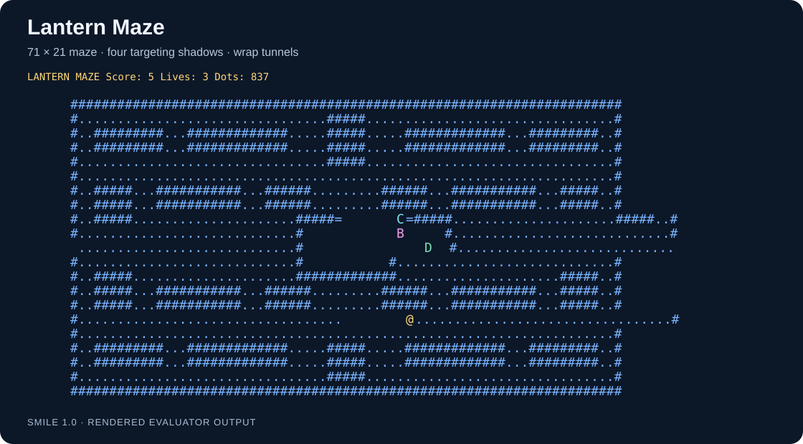
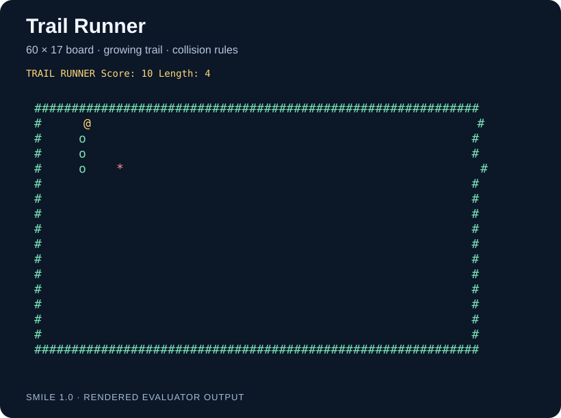
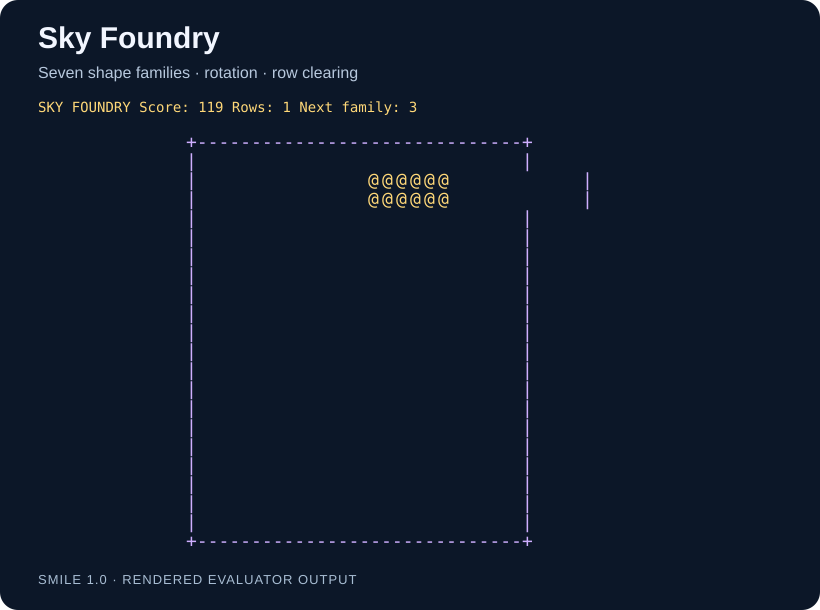
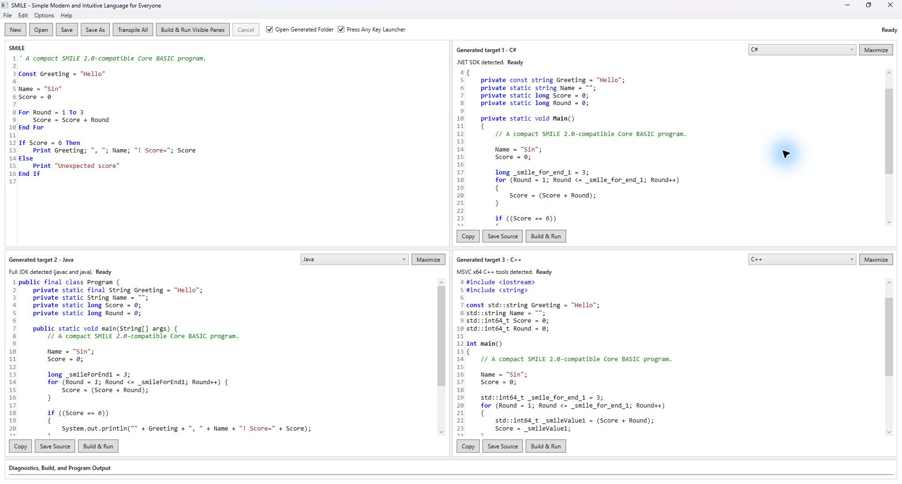
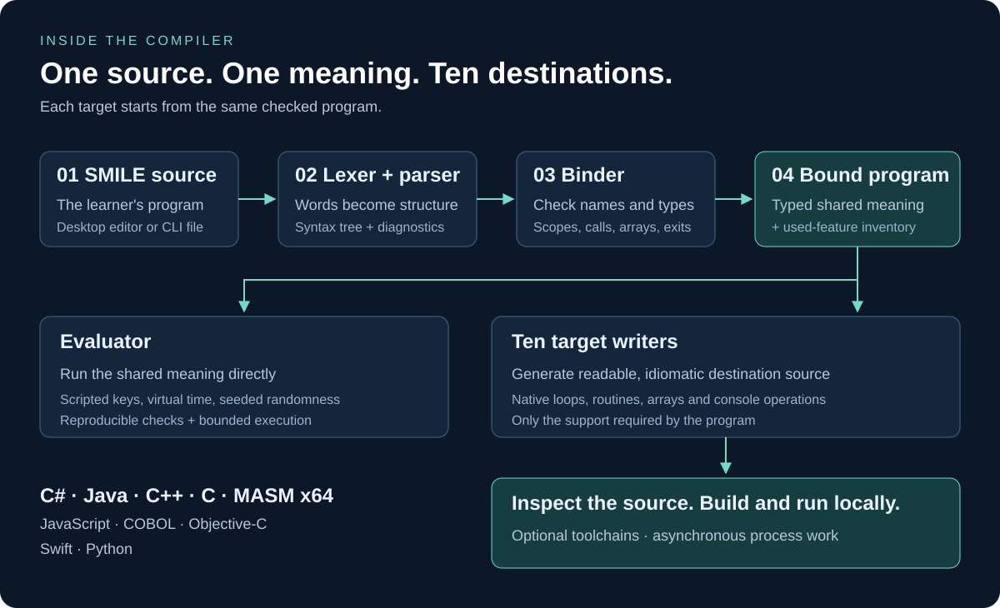

# SMILE 1.0

**Simple Modern and Intuitive Language for Everyone**

Write a small, readable program. See how it becomes C#, Java, C++, and seven other languages. SMILE is a beginner-first educational language, a working transpiler, and a Windows desktop environment for exploring the connection between source code and the code a compiler generates.

**Current release:** `1.0.0` · **Language:** Core BASIC 2.1 — Text-Game Foundation · **10 active targets** · **Windows / .NET 10**

[Latest progress](#latest-progress) · [Desktop](#see-the-same-program-in-three-languages) · [Small programs](#small-programs-you-can-read-and-run) · [Compiler](#how-the-compiler-works) · [Quick start](#quick-start) · [Contribute](#the-engineering-and-the-opportunity)

## Latest progress

### Text, routines, Double math, and persistence back-ported from SMILE 2.0

`Text_Length`, `Text_Code_At`, and `Text_Slice` now inspect Unicode scalars, including emoji. Routines support exact-type `ByRef` variables and array cells, typed Optional defaults, named arguments, and multiline parameter lists; Number expressions also accept unary `+`. The evaluator and all ten targets preserve argument evaluation order. Windows C#, Java, and Python output explicitly uses UTF-8 when the program contains Unicode text.

`Double` adds fractional and exponent values while `Number` stays a whole-number type. All ten targets support Double variables, arrays, routines, Optional defaults, exact comparisons, explicit Number/Text conversions, and the math functions below. Invalid domains, zero divisors, conversion overflow, and nonfinite results fail with the SMILE source line.

```smile
Dim Speed As Double
Speed = ToDouble(3) / 2.0
Print Speed
Print Sqrt(9.0); ":"; Round(2.5)
Print Text_From_Double(-0.0)
```

This prints `1.5`, `3.0:2.0`, and `-0.0`. Double math also includes `Abs`, `Min`, `Max`, `Clamp`, `Sin`, `Cos`, `Atan2`, `Floor`, `Ceiling`, and `Truncate`. Use `ToNumber` for checked truncation and `Text_To_Double` to parse invariant decimal text. No implicit Number/Double conversion occurs.

The text, console and core-language back-port is recorded in the [back-port inventory](docs/SMILE%202%20Core%20Backport%20Progress.md). Modules, application projects and deterministic source-owned libraries are supported. Double output uses native binary64 arithmetic and standard math APIs, with small checks where the target permits infinities or has different conversion rules. COBOL needs C interoperability for exact binary64 operations because its ordinary decimal arithmetic and numeric transfers lose distinctions required by SMILE. Exponent spelling and transcendental rounding can differ between targets.

`ByRef` changes the caller's storage immediately, including when two parameters
refer to the same variable. Ordinary parameters remain independent ByVal copies.
Array indices are captured and checked once, in source order, before later
arguments run. Optional parameters must be ByVal.

```smile
Dim Score As Number
Call AddPoint(Score)
Print Score

Sub AddPoint(ByRef Value As Number)
    Value = Value + 1
End Sub
```

This prints `1`. C#, C/C++, MASM, and COBOL use native references or pointers.
Java, JavaScript, and Python pass ordinary mutable arrays with a captured index;
only addressed scalar variables need a one-element array. Swift uses `inout`
where exclusive access is safe and a small location closure for shared aliases.

`Load Text File Path Into Bytes Count ByteCount` now reads bounded UTF-8 bytes
into a one-dimensional Number array on all ten targets. It removes an initial
UTF-8 BOM, clears unused cells, and returns zero for missing/unreadable files.
Paths are normalized relative to the executable (or script/class directory),
with escaping paths rejected. Place data files there when running generated
programs, or declare project assets to publish them automatically. Node.js reads
asynchronously. See the [official file-read contract](docs/SMILE%20Language%20Specification/003%20-%20SMILE%20Core%20BASIC%202.1%20Text-Game%20Foundation%20Official%20Specification.md#load-text-file).

Console controls also recognize O/F/G/R/P/B/X/Y/Z/E/C, Backtick, Plus and Minus
with SMILE 2.0 key codes on every target. `KEY_CONTROL` reports standalone left/right Control presses through native console events.

Integer `Load` and `Save` persist Number values across runs on all ten targets:

```smile
Dim Best As Number
Load Best From "best-score" Default 0
Best = Max(Best, 100)
Save Best To "best-score"
```

Keys are nonempty Text literals. Load always evaluates its Number default first;
missing, invalid, or unreadable values use it. Save accepts a Number variable or
constant and ignores storage failures. Files contain plain decimal integers under
`%LOCALAPPDATA%\SMILE\Games\<program>\<key>.txt`. CLI/Desktop use the source
filename stem for a stable program identity across targets and temporary runs;
Save As with a new name selects a different storage directory. Names/keys replace
non-ASCII letters/digits (except `_` and `-`) with underscores. This is a separate
SMILE 1.0 namespace; it does not import SMILE 2.0 saves automatically.

`Save Data Bytes Count Length To Key Status State` and
`Load Data Key Into Bytes Count Length Status State` now persist byte arrays on
all ten targets. Computed Text keys, SHA-256 checksums, 1 MiB blocks, backup
recovery and the `DATA_STATUS_*` constants follow SMILE 2.0. Checked loads keep
the array intact on failure; successful loads change only the returned bytes.
Omit Status for strict operations that stop on storage errors (a missing load
returns zero). See the [Data contract](docs/SMILE%20Language%20Specification/003%20-%20SMILE%20Core%20BASIC%202.1%20Text-Game%20Foundation%20Official%20Specification.md#data-persistence),
including Node.js's two-step atomic backup/primary publication. Projects use an
explicit ApplicationId, falling back to OutputName; loose files also accept
`--application-id`. Libraries share their consuming application's identity.

Nominal enums now work in the evaluator and all ten targets:

```smile
Enum Direction
    None
    Left = -1
    Right = 1
End Enum
Dim Heading As Direction
Heading = Direction.Left
Print Heading = Direction.Left
```

Members hold checked signed 64-bit values; aliases are allowed and storage
defaults to zero. Enum arrays, Const, exact-type ByVal/ByRef, Optional defaults,
returns and Select Case are supported. Enum values cannot be printed, converted
to Number, ordered or used in arithmetic. See the [enum contract](docs/SMILE%20Language%20Specification/003%20-%20SMILE%20Core%20BASIC%202.1%20Text-Game%20Foundation%20Official%20Specification.md#nominal-enums).

`Type` records group values and copy them independently, including nested records
and fixed array fields. They work in the evaluator and all ten targets:

```smile
Type ScoreEntry
    Player As Text
    Points As Number
End Type
Dim Current As ScoreEntry
Dim Saved As ScoreEntry
Current.Player = "Sin"
Current.Points = 10
Saved = Current
Current.Points = 20
Print Saved.Player; ":"; Saved.Points
```

Records support variables, array cells, ByVal/ByRef parameters and returns.
Writable fields can be passed ByRef, including fixed-array field cells, and can
receive Data Count/Status outputs. Copying a whole record preserves existing
references into its fields. Whole records cannot be printed, compared, used in
arithmetic or stored in Const. `With CurrentEntry` ... `End With` captures a writable
record location once; leading-dot expressions such as `.Points` use that record.
Nested blocks use the nearest receiver, and array indexes run once on entry.
Types also contain Sub/Function methods and Property Get/Set accessors. `Me`
borrows the current record; a setter receives its new value as `Value`. Methods
and properties are Public by default and may be Private; fields remain Public.
Member calls support Optional and named arguments. A property assignment evaluates
its new value before capturing its receiver.

`Class` declares reference objects. `Dim Board As New ScoreBoard()` or
`Board = New ScoreBoard()` constructs an instance; assignment, ByVal and returns
copy its reference. An optional `Sub New(...)` initializes fields. Class fields
are Private by default, while methods and properties are Public by default.
`Nothing` is the default reference; `Is` and `Is Not` compare identity. `With Board`
captures the reference once, even if Board is reassigned inside the block. A
Nothing receiver fails before method arguments or field indexes run. Class fields
may contain scalar values, enums, records and fixed arrays, but not other class
references; arrays of class references are also unsupported, matching SMILE 2.0.

`Module ... End Module`, `Import Name As Alias`, source-local imports/Option
Explicit, Public/Private module declarations and qualified names work across
multiple sources and all ten targets. Application `.smileproj` files select a
startup source, references, runtime assets and persistent ApplicationId. Desktop
opens the project and edits its startup source. The CLI also builds and consumes
deterministic `.smilelib` format-7 packages with exact dependencies and source/API
validation. Try [Scoreboard](examples/modules/Scoreboard.smileproj) or follow the
[Modules and Projects guide](docs/Modules%20and%20Projects.md).

```powershell
dotnet run --project src/SMILE.Cli -- --project examples/modules/Scoreboard.smileproj --target python --run
dotnet run --project src/SMILE.Cli -- --project examples/modules/library/Counters.smilelibproj --target library -o out/Counters.smilelib
```

### Three original games, written entirely in SMILE

The latest implementation expands the terminal games with larger boards, named colors, cursor-based redraws, and state-driven updates. Their rules live in ordinary `.smile` programs: arrays hold the board, routines organize behavior, and loops respond to keys and time.



**[Lantern Maze](examples/text-maze-muncher.smile)** — explore a symmetric 71-by-21 collection maze, travel through side tunnels, and avoid four shadows with different targeting behavior.

| Trail Runner | Sky Foundry |
|---|---|
|  |  |
| **[Read the program](examples/text-snake.smile)** — steer a growing trail, eat food, and avoid the border and your own path. | **[Read the program](examples/text-falling-blocks.smile)** — move and rotate seven families of four-cell shapes, complete rows, and keep the board clear. |

*The three board diagrams above render actual evaluator output with scripted input, including cursor-positioned characters. They are illustrations of captured game states, not terminal screenshots; presentation colors are illustrative. [Visual provenance](docs/assets/readme/README.md).*

These are terminal games. Run their generated programs in an attached Windows console of at least **80 columns × 25 rows**. The games prepare rows before overwriting the previous frame, redraw when state changes, and clear at screen transitions. Keyboard controls do not require Enter after each move.

### Recent foundations beneath the games

| Implemented progress | What it enables |
|---|---|
| **Larger, colored terminal games** | Three complete examples with real-time controls, scores, and reusable routines. |
| **Explicit source formatting** | `Format SMILE` or `Ctrl+K, Ctrl+D` formats valid source in one undoable edit. |
| **Find and Go to Line** | `Ctrl+F` and `Ctrl+G` navigate the focused source or generated-code editor. |
| **Core BASIC 2.1 terminal primitives** | Fixed 2D arrays, key polling, cursor movement, colors, timing, and random values. |
| **Readable target output** | Native control flow and routines, semantic spacing, and support emitted only when needed. |

## See the same program in three languages



*Current Desktop build, captured for this README. The source is [`examples/core-basic.smile`](examples/core-basic.smile); the three destination panes favor C#, Java, and C++.*

The Desktop makes the compiler visible: edit SMILE on the left, inspect the generated source, then build and run with an installed target toolchain. All ten targets remain selectable. Toolchain discovery, generation, compilation, and process work run asynchronously so the editor stays responsive.

Desktop loads the cumulative [`language.smile`](examples/language.smile) reference after its first paint. Live transpilation updates the visible target without rewriting learner source. Recoverable failures appear in the output area and keep the IDE open.

## Small programs you can read and run

Save any of these snippets as a `.smile` file and open it in Desktop, or use the CLI in the [quick start](#quick-start). Each example is complete.

### 1. Greet someone

Variables can begin with a direct assignment. `Print` joins its semicolon-separated expressions on one line.

```smile
Name = "Sin"
Print "Hello, "; Name; "!"
```

```text
Hello, Sin!
```

### 2. Add a sequence and make a decision

`For` includes both endpoints. `If` keeps the condition readable.

```smile
Total = 0

For StepNumber = 1 To 3
    Total = Total + StepNumber
End For

If Total = 6 Then
    Print "Total="; Total
End If
```

```text
Total=6
```

### 3. Store scores and call a function

Use explicit types when teaching declarations. Array indexes start at zero; routines accept typed values.

```smile
Option Explicit

Dim Scores[3] As Number

Dim Index As Number
Dim Total As Number

Scores[0] = 1
Scores[1] = 2
Scores[2] = 3

For Index = 0 To 2
    Total = Total + Scores[Index]
End For

Print "Double="; Double(Total)

End Program

Function Double(Value As Number) As Number

    Return Value * 2

End Function
```

Expected output:

```text
Double=12
```

### 4. Start a game board

A two-dimensional array stores a grid. `Abs` provides a simple building block for distance calculations.

```smile
Dim Board[4, 3] As Text

Board[1, 1] = "@"

PlayerX = 1
EnemyX = 6

Print "Player="; Board[1, 1]
Print "Distance="; Abs(PlayerX - EnemyX)
```

```text
Player=@
Distance=5
```

For complete interactive programs, follow the three game sources above or the smaller [Text-Game Foundation example](examples/text-game-foundation.smile).

## How the compiler works

The engine carries immutable type symbols through binding, evaluation and
generation. Built-in types are shared symbols; storage categories are separate
from exact type identity. Each Enum and Type declaration owns a distinct type
symbol, as does each Class declaration.
For Engine API callers, `SmileType` is now a symbol class with `Kind` and `Name`;
the existing `SmileType.Integer`, `Double`, `String`, `Boolean`, and `Error`
members remain available. Parsed declarations carry `TypeNameSyntax`; the binder
resolves those names to symbols. Existing scalar source remains valid.



1. **Parse the structure.** The lexer and parser recognize the canonical language and preserve source locations for diagnostics.
2. **Check the meaning.** The binder resolves names, scopes, types, routines, arrays, and control flow into one bound program.
3. **Evaluate or generate.** The evaluator and every target writer consume that same checked meaning. Targets do not reparse the learner's program.
4. **Read, build, and run.** Writers produce normal destination source. Optional toolchains compile or execute it in temporary workspaces.

Generated code is part of the lesson. A SMILE loop should remain a recognizable loop, a routine should become an ordinary routine, and a tiny program should produce proportionate output. Target-specific helpers are used only where needed to preserve meaning. See the [architecture](docs/Architecture.md) and [generation standard](docs/SMILE%20Target%20Code%20Generation%20Standard%20v1.0.md) for the actual boundaries and tradeoffs.

## Canonical language

SMILE 1.0 accepts one canonical language: **Core BASIC 2.1 — Text-Game Foundation**. The shared Core BASIC subset aligns with SMILE 2.0; `2.1` is a language milestone, not a second product or a selectable dialect.

Core BASIC 2.1 provides:

- case-insensitive Unicode identifiers and apostrophe comments;
- `Number`, `Boolean`, and `Text` scalar values with exact fixed types;
- implicit variables by first direct assignment, explicit `Dim ... As ...`, and immutable `Const` values;
- typed expressions with normal precedence, short-circuit `And`/`Or`, Text concatenation, truncating division, and signed `Mod`;
- expression-list `Print`, including blank Print and trailing-semicolon newline suppression;
- `If / Else If / Else / End If`;
- ascending `For ... To` and descending `For ... Down To`, closed by `End For`;
- post-tested `Do / Loop Until`, unconditional `Do / Loop`, `Exit For`, and `Exit Do`;
- optional `Option Explicit`;
- top-level `Sub` and `Function` routines, `Call`, `Return`, exact typed ByVal/ByRef parameters, routine-local scope, and recursion;
- Optional literal/Const defaults, named arguments using `Name:=Value`, and multiline routine declarations;
- Unicode scalar `Text_Length`, `Text_Code_At`, and `Text_Slice`, plus unary Number `+`;
- `Select Case` over exact scalar constants;
- checked fixed one- and two-dimensional arrays with zero-based indexes;
- nonblocking `Get Key`, stable `KEY_*` constants, `Clear Screen`, 1-based `Move Cursor To`, named `Text Color`, and millisecond `Wait`;
- inclusive `Random ... From ... To ...`, monotonic `Timer()`, and `Abs`/`Min`/`Max`;
- `End Program`.

The complete current language is defined by the [SMILE Core BASIC 2.1 Text-Game Foundation Official Specification](docs/SMILE%20Language%20Specification/003%20-%20SMILE%20Core%20BASIC%202.1%20Text-Game%20Foundation%20Official%20Specification.md). The [Core BASIC 2.0 specification](docs/SMILE%20Language%20Specification/002%20-%20SMILE%20Core%20BASIC%202%20Official%20Specification.md) and [Profile 2.0 record](docs/SMILE%20Core%20BASIC%20Profile%202.0.md) preserve the unchanged shared subset and parity corpus. See the [migration guide](docs/Migrating%20to%20Core%20BASIC%202.md), [parity report](docs/Core%20BASIC%202%20Parity%20Report.md), and self-contained [student language reference](docs/smile-1-language-reference.html).

This release intentionally rejects earlier SMILE 1.0-only syntax. The compiler does not silently reinterpret old source. Core BASIC 1 remains a valid subset, while its former active documentation is preserved under `Requirements/Archive/Core-BASIC-1`.

**Current boundaries:** no blocking `Input`, graphical game window, sound, arbitrary file I/O, or dynamic arrays. Bounded text-file reads, project assets, modules/libraries and Number/Data persistence are supported. Library package builds use the CLI; Desktop edits an application project's startup source. `Number` is a signed 64-bit whole-number type. This is an active research project; deliberate language improvements update living examples and documentation together, without a legacy parser or external backward-compatibility promise.

## Ten active targets

The same parsed and bound program generates all ten active destinations:

| CLI ID | Destination | Primary file |
|---|---|---|
| `csharp` | C# | `Program.cs` plus a minimal project file |
| `c` | C | `Program.c` |
| `masm-x64` | Windows x64 MASM Assembly | `Program.asm` |
| `javascript` | JavaScript (Node.js) | `Program.js` |
| `java` | Java | `Program.java` |
| `cobol` | COBOL | `Program.cob` |
| `objective-c` | Objective-C | `Program.m` |
| `swift` | Swift | `Program.swift` |
| `python` | Python | `Program.py` |
| `cpp` | C++ | `Program.cpp` |

Generated code uses native destination constructs whenever practical: ordinary routines and call frames, locals/globals, arrays, conditionals, counted and post-test loops, combined destination-native output, native selection where its type rules are exact, and direct process termination. A shared semantic layout keeps imports, state, entry code, learner routines, and unavoidable support in readable sections.

<details>
<summary>Target-native implementation details</summary>

Helpers appear only when a target needs one to preserve semantics, such as checked indexes, C Text concatenation, or Python's typed exit across differently nested loop kinds. C, Objective-C, and MASM Text concatenation uses explicit generated roots and bounded statement-boundary collection; a feature-gated MASM C companion supplies only that lifetime mechanism. COBOL pairs its native fixed `PIC X(4096)` Text storage with an explicit logical length so `DISPLAY` preserves meaningful spaces in variables, arrays, routine calls, returns, comparisons, concatenation, and game cells. Python output is a direct module-level script—no synthetic `main()` wrapper. JavaScript is executed by Node.js with no npm dependency. Only `Get Key` adds a small generated Windows console addon, built locally with the installed Visual Studio C++ tools.

For interactive programs, generated code polls real terminal keys without requiring Enter, clears or positions the attached console, applies named foreground/background colors, waits without a busy loop, and restores changed input state. Games explicitly reset their colors before returning. Node.js uses async `main` only for Wait or asynchronous file/persistence operations; its delay remains Promise-based and key polling does not change stdin mode. Noninteractive programs receive none of that support.

See [Architecture](docs/Architecture.md), [Toolchains](docs/Toolchains.md), and the [Target Code Generation Standard](docs/SMILE%20Target%20Code%20Generation%20Standard%20v1.0.md).

</details>

## Examples

- [`examples/language.smile`](examples/language.smile) — cumulative valid language reference packaged with Desktop;
- [`examples/core-basic.smile`](examples/core-basic.smile) — compact end-to-end example;
- [`examples/control-flow.smile`](examples/control-flow.smile) — counted loops, post-test loops, and typed exits;
- [`examples/core-basic-2-canonical.smile`](examples/core-basic-2-canonical.smile) — cumulative routines, Select, and arrays;
- [`examples/core-basic-2-byval-scope.smile`](examples/core-basic-2-byval-scope.smile) — ByVal isolation and shadowing;
- [`examples/core-basic-2-recursion.smile`](examples/core-basic-2-recursion.smile) — direct and mutual recursion;
- [`examples/core-basic-2-arrays.smile`](examples/core-basic-2-arrays.smile) — checked fixed arrays and their default values;
- [`examples/core-basic-2-select.smile`](examples/core-basic-2-select.smile) — exact typed Select cases;
- [`examples/core-basic-2-parameters.smile`](examples/core-basic-2-parameters.smile) — 0 through 16 parameters;
- [`examples/core-basic-2-evaluation-order.smile`](examples/core-basic-2-evaluation-order.smile) — left-to-right calls and short circuiting;
- [`examples/core-basic-2-local-arrays.smile`](examples/core-basic-2-local-arrays.smile) — fresh local arrays in ordinary and recursive calls;
- [`examples/core-basic-2-end-program-routine.smile`](examples/core-basic-2-end-program-routine.smile) — whole-program termination from a routine;
- [`examples/text-game-foundation.smile`](examples/text-game-foundation.smile) — compact 2D array and terminal-primitive demonstration;
- [`examples/text-snake.smile`](examples/text-snake.smile) — Trail Runner, a complete growing-trail game on a roomy 60-by-17 board;
- [`examples/text-maze-muncher.smile`](examples/text-maze-muncher.smile) — Lantern Maze, an original 71-by-21 symmetric collection maze with a ghost house, wrap tunnel, and four distinct targeting shadows;
- [`examples/text-falling-blocks.smile`](examples/text-falling-blocks.smile) — Sky Foundry, an original seven-family falling-block game with a widened, colored playfield;
- [`tests/CoreBasic2Parity/canonical.smile`](tests/CoreBasic2Parity/canonical.smile) — unchanged Profile 2 fixture compiled by both repositories.

All examples use only the canonical Core BASIC 2.1 language. The three games are terminal programs, not graphical games; use an attached Windows console of at least 80 columns by 25 rows for real-time controls and colored full-frame overwrite. They prepare complete rows before moving the cursor to the top-left, redraw only when state changes, and clear only at screen transitions, so there is no visible blank frame or instruction text beneath the playfield.

## Quick start

### Requirements

- Windows with the .NET 10 SDK for the solution, CLI, tests, and Desktop application;
- an optional destination toolchain to build/run generated output locally.

Target detection is independent. Missing optional compilers do not prevent transpilation or use of installed targets.

### Build and open Desktop

Restore and build:

```powershell
dotnet restore SMILE.sln
dotnet build SMILE.sln -c Debug --no-restore -nologo
dotnet run --project src/SMILE.Desktop --no-build
```

Open [`examples/core-basic.smile`](examples/core-basic.smile), select C#, Java, or C++ in a destination pane, and inspect the generated source. **Build & Run** becomes available when that destination's toolchain is installed; C# uses the .NET SDK already required above.

For a game, open its `.smile` file, leave **Open Generated Folder** and **Press Any Key Launcher** enabled, and use **Build & Run** for the chosen target. The redirected run cannot receive game keys; cancel that run once compilation finishes, or let its timeout return control. In the generated folder, launch the generated program or its press-any-key launcher in an attached console for keyboard play.

### Use the CLI

```powershell
dotnet run --project src/SMILE.Cli -- examples/core-basic.smile --target csharp --run
dotnet run --project src/SMILE.Cli -- examples/core-basic.smile --target java
dotnet run --project src/SMILE.Cli -- examples/core-basic.smile --target cpp
dotnet run --project src/SMILE.Cli -- examples/core-basic.smile --target all
```

### Format source explicitly

```powershell
dotnet run --project src/SMILE.Cli -- examples/language.smile --format
dotnet run --project src/SMILE.Cli -- examples/language.smile --check
pwsh -File scripts/Format-Smile.ps1 -Check
```

The formatter parses and binds first, preserves exact Text and apostrophe-comment content, normalizes logical paragraphs and four-space indentation, is idempotent, and leaves invalid source untouched. Desktop offers the same operation through **Edit → Format SMILE** or `Ctrl+K, Ctrl+D`.

## Validation

The repository includes language conformance, deterministic generation, Desktop, formatting, scripted game, real console, and toolchain tests. See the [validation architecture](docs/Architecture.md#validation-architecture) for their responsibilities. Test commands below describe available checks; they are not a claim that every matrix ran for this documentation update.

Run the focused mission guardrail:

```powershell
dotnet test tests/SMILE.Tests/SMILE.Tests.csproj -c Debug --filter TestCategory=MissionGuardrail -nologo
```

Run canonical conformance and generation tests:

```powershell
dotnet test tests/SMILE.Tests/SMILE.Tests.csproj -c Debug --filter "FullyQualifiedName~CoreBasicConformanceTests|FullyQualifiedName~CoreBasic2ConformanceTests|FullyQualifiedName~CoreBasicGenerationTests" -nologo
```

<details>
<summary>Broader milestone and parity checks</summary>

At a language milestone or release, run the profile and Text-Game Foundation matrices with their required toolchains installed:

```powershell
dotnet test tests/SMILE.Tests/SMILE.Tests.csproj -c Debug --filter TestCategory=MilestoneMatrix -nologo
pwsh -File scripts/Test-TextGameFoundation.ps1
```

Run the pinned cross-repository parity check:

```powershell
pwsh -File scripts/Test-CoreBasicParity.ps1
```

The parity command runs the retained Profile 1 gate and the new Profile 2 fixture/hash gate. It reads SMILE 2.0, verifies its pinned commit and exact working-tree status before and after, and writes all executable output beneath the system temporary directory. It never modifies SMILE 2.0 or pre-existing authority work.

</details>

## The engineering and the opportunity

Created by **[Sin / Louiery Sincioco](https://github.com/Sincioco)**, SMILE brings language design, compiler construction, native code generation, and desktop tooling together in a public, inspectable project. Its central question is practical: how can a beginner learn one clear idea and recognize it in several professional programming languages?

| Engineering work you can inspect | Where to look |
|---|---|
| One front end with typed binding and shared semantics | [Engine](src/SMILE.Engine) and [architecture](docs/Architecture.md) |
| Ten destinations with explicit native-language tradeoffs | [Generators](src/SMILE.Engine/Generation) and [generation standard](docs/SMILE%20Target%20Code%20Generation%20Standard%20v1.0.md) |
| Responsive WPF tools and cancellation-aware build/run integration | [Desktop](src/SMILE.Desktop) and [toolchains](src/SMILE.Toolchains) |
| Deterministic game evaluation, real-console tests, and parity fixtures | [Tests](tests/SMILE.Tests) and [parity report](docs/Core%20BASIC%202%20Parity%20Report.md) |

**For contributors:** useful work includes clearer beginner diagnostics, teaching examples, editor usability, and focused improvements to the ten existing targets. Read [AGENTS.md](AGENTS.md) and the [Core Principles](docs/SMILE%20Core%20Principles.md) first; [open an issue](https://github.com/Sincioco/SMILE/issues) to discuss a concrete improvement, or submit a focused pull request with relevant validation.

**For employers, collaborators, and supporters:** the source, examples, and design decisions provide a working portfolio of compiler and developer-tool engineering. Explore [Sin's GitHub profile](https://github.com/Sincioco) to connect about related projects, collaboration, or opportunities to support educational programming tools.

## Project policy

The active destination set is frozen at ten until Sin explicitly changes it. Routine validation follows Velocity Mode: use the smallest directly relevant checks, while broad all-target and cross-repository verification is appropriate for major milestones. Manual `SMILE CI` remains available through `workflow_dispatch`.

Historical requirement files are retained for research context, not as current language authority. Current behavior is governed by `AGENTS.md`, [Core Principles](docs/SMILE%20Core%20Principles.md), and the single current official specification.

The current hardening milestone is recorded in the [Human-Readable Formatting and Hardening Completion Report](docs/SMILE%201.0%20Human-Readable%20Formatting%20and%20Hardening%20Completion%20Report.md).

## License

SMILE is licensed under the GNU Affero General Public License v3.0. See [LICENSE](LICENSE).
