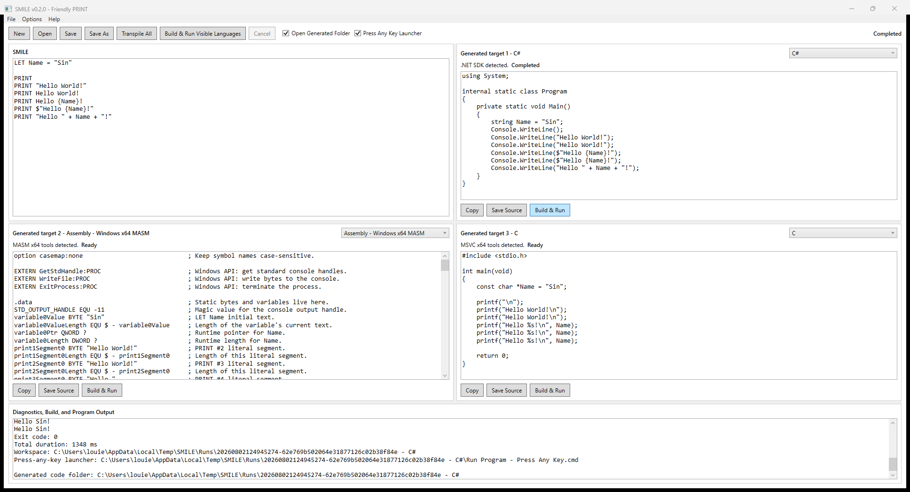

# SMILE

SMILE stands for Simple Modern Interactive Learning Environment. It is a modern programming language inspired by BASIC, designed to help newcomers learn both how to write code and how programming languages work by transpiling and compiling the same logic across multiple target languages.

Write a simple SMILE program once, then view equivalent programs in C#, C, COBOL, Windows x64 MASM Assembly, JavaScript, Java, Objective-C, Swift, Python, and C++.

## Mission

SMILE is a modern programming language inspired by BASIC, designed to help newcomers learn not only how to write code, but also how programming languages work at a fundamental level. Building on BASIC’s simplicity and accessibility, SMILE allows students to transpile their code into multiple programming languages and compile the resulting programs. This enables learners to see how the same logic and concepts are expressed using different languages and syntaxes. Through this comparative approach, students can recognize an essential principle: despite their surface-level differences, all programming languages share the same core fundamentals. The primary goal is therefore not to memorize the syntax of a particular language, but to develop logical thinking, problem-solving skills, and a strong understanding of programming concepts. By combining simplicity, experimentation, and cross-language learning, SMILE provides a fun and educational environment that teaches students how to think like programmers.

## Video Introduction

[](https://www.youtube.com/watch?v=fgyIMCdHcug)

[Watch the SMILE introduction on YouTube](https://www.youtube.com/watch?v=fgyIMCdHcug).

## Current Release

SMILE v0.8.0 — WHILE Loops — adds case-insensitive, pre-test `WHILE condition` / `END WHILE` blocks. A loop may run zero or more times, re-evaluates its explicit call-free Boolean condition from current storage before every iteration, and remains genuine runtime control flow in all ten target languages.

WHILE bodies permit PRINT, SET, INPUT, IF, nested WHILE, comments, blank lines, and SET Block String Literals. LET remains prohibited inside WHILE until scopes exist. A shared IF/WHILE nesting limit protects the editor at depth 129, the evaluator supports cancellation for intentional infinite loops, and loop analysis uses a terminating zero-or-more fixed point with conservative Integer, Boolean, String, and known-value facts. The release preserves v0.7.0 INPUT semantics and every v0.7.0.1 independent target-editor ownership rule.

```text
SMILE source
  -> lex source into tokens
  -> classify full-line comments and blank lines as ordered non-semantic source items
  -> normalize SET Block String content entirely in the front end
  -> parse logical lines into recursive ordered source-item lists and canonical syntax nodes
  -> bind declarations, SET/INPUT mutations, IF clauses, WHILE bodies, typed expressions, comments, and layout once
  -> solve loop-head fixed points, then record statement facts once with branch-aware Known/Unknown/Invalid environments
  -> simplify pure bound expressions with mutation-aware, branch-safe, loop-safe values and reachability
  -> identify variables mutated by SET or INPUT anywhere in IF/WHILE trees
  -> map SMILE symbols to safe target identifiers once per target
  -> choose one idiomatic target Integer and String plan from every branch, loop-head fact, and runtime input fact
  -> generate ten target programs with genuine branches and loops, native input, checked runtime arithmetic, native comments, preserved blank lines, and real storage updates
  -> read and compute from current generated storage for every branch-aware Unknown expression
  -> compare generated stdout, stderr, and exit code to the SMILE reference evaluator with scripted stdin
  -> show three debounced live target previews with line numbers and syntax highlighting
  -> build and run locally when the matching toolchain is installed
  -> keep the desktop IDE responsive when a target toolchain fails or target languages are switched rapidly
```

The official language specifications are published in [docs/SMILE Language Specification](docs/SMILE%20Language%20Specification):

- [001 - SMILE - SET Statement Official Specification v1.0](docs/SMILE%20Language%20Specification/001%20-%20SMILE%20-%20SET%20Statement%20Official%20Specification%20v1.0.md)
- [002 - SMILE - PRINT Statement Official Specification v1.0](docs/SMILE%20Language%20Specification/002%20-%20SMILE%20-%20PRINT%20Statement%20Official%20Specification%20v1.0.md)
- [003 - SMILE - String Literals Official Specification v1.0](docs/SMILE%20Language%20Specification/003%20-%20SMILE%20-%20String%20Literals%20Official%20Specification%20v1.0.md)
- [004 - SMILE - Core Types and Expressions Official Specification v1.0](docs/SMILE%20Language%20Specification/004%20-%20SMILE%20-%20Core%20Types%20and%20Expressions%20Official%20Specification%20v1.0.md)
- [005 - SMILE - LET Statement Official Specification v1.0](docs/SMILE%20Language%20Specification/005%20-%20SMILE%20-%20LET%20Statement%20Official%20Specification%20v1.0.md)
- [006 - SMILE - IF Statement Official Specification v1.0](docs/SMILE%20Language%20Specification/006%20-%20SMILE%20-%20IF%20Statement%20Official%20Specification%20v1.0.md)
- [007 - SMILE - Full-Line Comments and Source Layout Preservation Official Specification v1.0](docs/SMILE%20Language%20Specification/007%20-%20SMILE%20-%20Full-Line%20Comments%20and%20Source%20Layout%20Preservation%20Official%20Specification%20v1.0.md)
- [008 - SMILE - INPUT Statement Official Specification v1.0](docs/SMILE%20Language%20Specification/008%20-%20SMILE%20-%20INPUT%20Statement%20Official%20Specification%20v1.0.md)
- [009 - SMILE - WHILE Statement Official Specification v1.0](docs/SMILE%20Language%20Specification/009%20-%20SMILE%20-%20WHILE%20Statement%20Official%20Specification%20v1.0.md)

## Guiding Principles

KISS means the simplest complete solution wins. SMILE avoids speculative features, unnecessary abstractions, heavy frameworks, parser generators, CLI frameworks, and third-party MVVM or process libraries.

KISS v2, "The Sin Way," puts user-experience performance first and functional performance second. Typing should feel immediate, build/run work should be cancellable, and compiler/toolchain work must not block the WPF UI thread.

Generated code follows the same rules: complete, minimal, idiomatic, readable, deterministic, educational, and dependency-light.

## Simple SMILE Program

```basic
LET Name = ""
LET Counter = 0

PRINT Enter your name:
INPUT Name

PRINT Hello {Name}.
PRINT Counter={Counter}

SET Counter = Counter + 1

IF Counter = 1 THEN
    PRINT Counter after SET={Counter}
ELSE
    PRINT Counter was not updated.
END IF

WHILE Counter < 3
    SET Counter = Counter + 1
    PRINT Counter in WHILE={Counter}
END WHILE
```

Input:

```text
Sin
```

Output:

```text
Enter your name:
Hello Sin.
Counter=0
Counter after SET=1
Counter in WHILE=2
Counter in WHILE=3
```

## LET, SET, INPUT, PRINT, IF, WHILE, Comment, And Source-Layout Syntax

Implemented grammar:

```text
program          -> source-item-list end-of-file
source-item-list -> source-item*
source-item      -> blank-line | full-line-comment | statement
blank-line       -> hspace* line-end
full-line-comment -> hspace* (REM rem-boundary | '//' | '#' | '--') comment-payload? statement-end
statement        -> let-statement | set-statement | input-statement | print-statement | if-statement | while-statement
let-statement    -> LET hspace+ identifier hspace* '=' hspace* expression
set-statement    -> SET hspace+ identifier hspace* '=' hspace* set-value
set-value        -> expression | set-block-string-literal
input-statement  -> INPUT hspace+ identifier hspace* statement-end
print-statement  -> PRINT
                  | PRINT hspace+ interpolated-string
                  | PRINT hspace+ quoted-expression
                  | PRINT hspace+ raw-template
if-statement     -> IF hspace+ if-condition hspace+ THEN hspace* line-end
                    branch-statement-list
                    else-if-clause*
                    else-clause?
                    END hspace+ IF hspace* statement-end
else-if-clause   -> ELSE hspace+ IF hspace+ if-condition hspace+ THEN hspace* line-end
                    branch-statement-list
else-clause      -> ELSE hspace* line-end branch-statement-list
branch-statement-list -> (blank-line | full-line-comment | branch-statement)*
branch-statement -> print-statement | set-statement | input-statement | if-statement | while-statement
if-condition     -> expression subject to the explicit-comparison and call-free IF rules
while-statement  -> WHILE hspace+ while-condition hspace* line-end
                    while-statement-list
                    END hspace+ WHILE hspace* statement-end
while-statement-list -> (blank-line | full-line-comment | while-body-statement)*
while-body-statement -> print-statement | set-statement | input-statement | if-statement | while-statement
while-condition  -> expression subject to the explicit-comparison and call-free WHILE rules
expression       -> typed expression with precedence
```

A SET Block String Literal begins when the opening `"` is the final non-whitespace character on the physical SET line. Its closing delimiter is a line whose only non-whitespace character is `"`. The block token consumes its internal physical newlines, so the complete block remains one logical SET statement.

Implemented rules:

- `PRINT`, `LET`, `SET`, `INPUT`, `IF`, `THEN`, `ELSE`, `END`, and `WHILE` are case-insensitive.
- `REM`, `//`, `#`, and `--` begin equivalent full-line comments only when the marker is the first non-space-or-tab content on a physical line. Symbol markers need no following whitespace.
- Contextual `REM` is ordinal case-insensitive and must be followed by a space, tab, line ending, or EOF. `REMEMBER`, `REMARK`, `REMOTE`, `REM:`, and `REM#` are not comments, and `REM` remains a valid variable name outside first-position comment syntax.
- Inline and trailing comments are not implemented. `PRINT // text`, `PRINT # text`, `PRINT -- text`, and `PRINT REM text` remain raw printable text.
- Each blank physical line outside a Block String is retained as one ordered non-semantic layout item; spaces and tabs on that otherwise blank line are not copied to targets.
- Variable lookup is ordinal case-insensitive.
- SMILE v1.0 identifiers use portable ASCII letters, digits, and `_`; identifiers must start with an ASCII letter or `_`.
- `LET`, `SET`, `INPUT`, `PRINT`, `IF`, `THEN`, `ELSE`, `END`, `WHILE`, `TRUE`, `FALSE`, `NOT`, `AND`, and `OR` are reserved SMILE keywords and cannot be variable names in any casing. `ELSEIF`, `ENDIF`, and `ENDWHILE` are not combined keywords.
- `LET` declares a variable, fixes its type as `String`, `Integer`, or `Boolean`, evaluates its initializer, and stores the initial current value.
- A `LET` variable becomes visible only after its initializer binds and evaluates successfully, so forward references and self-references fail as undefined variables.
- `SET` changes an existing variable and never declares one. The target must have an earlier successful LET declaration.
- A SET right side must have exactly the variable's fixed type. SMILE performs no implicit assignment conversion.
- The complete SET right side evaluates before the current value changes, so `SET Counter = Counter + 1` reads the old value and updates atomically.
- `INPUT` changes exactly one existing variable and never declares one. It has no expression, built-in prompt, multiple-target, AS, or automatic-retry form.
- Each executed INPUT consumes one logical line ending at CRLF, LF, standalone CR, or final nonempty EOF. EOF before any character is available is runtime error `SMILER1501`.
- Redirected input is strict UTF-8. A logical line may contain at most 4096 UTF-8 bytes after removing its terminator and before Integer or Boolean trimming.
- String INPUT preserves the complete line, including leading/trailing spaces, tabs, Unicode, an empty line, and embedded NUL. It does not decode SMILE escape sequences.
- Integer INPUT trims only ASCII spaces/tabs, accepts one optional sign and ASCII decimal digits, and requires `-9223372036854775808` through `9223372036854775807`.
- Boolean INPUT trims only ASCII spaces/tabs and accepts only TRUE or FALSE ordinal case-insensitively.
- INPUT updates atomically only after the complete line, size, decoding, and conversion succeed. A runtime failure leaves the old value unchanged, writes one canonical stderr line, returns exit code 1, and stops later SMILE statements.
- `PRINT`, later LET initializers, interpolation holes, later SET expressions, and IF/WHILE conditions read the current value established by earlier LET, SET, or INPUT statements.
- `IF condition THEN` begins a block conditional and one `END IF` closes its complete IF / ELSE IF / ELSE chain.
- `ELSE IF` is a clause only when ELSE and IF occur on the same logical header line. An IF after a standalone ELSE line is nested and needs its own END IF.
- Every complete IF condition has type Boolean, invokes no function or procedure, and contains an explicit comparison at every Boolean leaf. Standalone Boolean variables and literals are not conditions.
- Conditions retain normal left-to-right `AND`/`OR` short-circuit evaluation, but parsing, binding, structural validation, and type checking still inspect both operands and every source branch.
- IF v1.0 branches permit `PRINT`, `SET`, `INPUT`, nested `IF`, `WHILE`, full-line comments, blank lines, and SET Block String Literals. `LET` is rejected inside every IF-related body because SMILE has no block scope. Only an executed branch consumes input.
- Clauses are tested in order; only the first successful clause executes, otherwise ELSE executes when present. Only the selected branch mutates evaluator state.
- Every generator preserves all source branches even when current values make one branch predictable. Known-value analysis merges outgoing paths and propagates a post-IF value only when every possible path proves the same value.
- `WHILE condition` begins a block-only pre-test loop and `END WHILE` closes it. At least one space or tab must follow WHILE; the header has no THEN or DO keyword and cannot contain a one-line body.
- Every WHILE condition has type Boolean, invokes no function or procedure, and contains an explicit comparison at every Boolean leaf. It is tested before the first iteration and after every completed iteration.
- WHILE v1.0 bodies permit `PRINT`, `SET`, `INPUT`, `IF`, nested `WHILE`, full-line comments, blank lines, and SET Block String Literals. LET is rejected recursively anywhere lexically inside a WHILE body until scopes are introduced.
- WHILE may execute zero or more times. SET and successful INPUT mutations persist into the next condition test; only reached loop bodies consume input or produce runtime failures.
- `WEND`, `ENDWHILE`, `LOOP`, `BREAK`, and `CONTINUE` are not WHILE syntax. Infinite loops are valid and rely on host cancellation or process timeout rather than an implicit iteration cap.
- IF and WHILE share a combined control-flow nesting limit. Depth 1 through 128 is supported; a 129th IF reports `SMILE1416`, a 129th WHILE reports `SMILE1611`, and bounded mixed-block recovery does not recurse into the rejected body.
- Loop analysis includes the zero-iteration path, solves stable loop-head facts before recording body facts once, widens loop-carried Integer ranges, and retains a post-loop Known value only when every represented exit agrees.
- Every String assigned through WHILE must retain a finite compile-time maximum UTF-8 byte length. Unbounded recurrence such as `SET Text = Text + "x"` reports `SMILE1612`; v1.0 deliberately does not infer a finite trip count to accept it.
- A SET Block String Literal is valid only as the complete SET value. It is not legal in LET, PRINT, interpolation, concatenation, or parentheses.
- Block delimiter lines are excluded. Each boundary between content lines becomes one logical `\n`, with no automatic leading or trailing newline.
- The exact spaces/tabs before the closing quote form the structural indentation margin. That exact margin is removed only from content lines that begin with it; all additional or nonmatching whitespace is preserved.
- Blank content lines, trailing spaces/tabs, quotes inside content, and `\\`, `\"`, `\n`, `\r`, `\t`, `\0`, `\b`, and `\f` are preserved with official String semantics.
- CRLF, LF, and accepted standalone CR source separators normalize to logical `\n` inside block values.
- Strings use official escapes: `\\`, `\"`, `\n`, `\r`, `\t`, `\0`, `\b`, and `\f`.
- Integers are signed 64-bit values.
- Booleans are `TRUE` and `FALSE`; display text is always `TRUE` or `FALSE`.
- Arithmetic supports `+`, `-`, `*`, and `/` on integers.
- String concatenation supports `+` on strings only.
- Comparison supports `=`, `<>`, `<`, `<=`, `>`, and `>=` where the type rules allow it.
- Boolean logic supports `NOT`, `AND`, and `OR`.
- `AND` and `OR` evaluate left to right and short-circuit at runtime: `FALSE AND ...` and `TRUE OR ...` do not evaluate their right operands. Both operands are still parsed, bound, and type-checked.
- After successful binding, one shared recursive statement-list analysis distinguishes Known, runtime-Unknown, and Invalid facts for `LET`, `SET`, `INPUT`, `PRINT`, `IF`, and `WHILE`. INPUT removes the target's old known value; the simplifier decides short-circuit reachability before visiting the right operand, never propagates stale state past SET or INPUT, and never deletes, duplicates, or unrolls INPUT, IF, or WHILE source control flow.
- Parentheses control expression grouping.
- SMILE does not perform implicit conversions in v0.8.0. For example, `"Age " + 49` is a type error.
- `PRINT` alone, or followed only by spaces/tabs, prints one blank line.
- `PRINT "Hello"` prints an ordinary quoted string.
- Ordinary quoted strings do not interpolate, so `PRINT "Hello {Name}!"` prints `{Name}` literally.
- `PRINT Hello World!` is a raw template and prints `Hello World!`.
- Raw templates and `$"..."` support `{expression}` interpolation.
- Raw placeholders are interpolation-oriented friendly syntax, so targets with native interpolation should show interpolation.
- `{{` and `}}` produce literal braces in raw templates and `$"..."`.
- `PRINT Name` prints the literal text `Name`.
- `PRINT {Name}` evaluates the variable `Name`; `PRINT {Age + 1}` evaluates the expression.
- `PRINT "Hello " + Name + "!"` supports string concatenation for `PRINT`.
- Explicit concatenation remains concatenation in generated code when the target language supports it.
- A semicolon is not a statement separator. In raw templates, `PRINT A; B; C` prints the semicolons literally.
- A physical line may contain only one statement.
- A SET Block String Literal is one logical statement spanning its delimiter and content lines.
- A second standalone `PRINT` keyword on the same line is a compiler error.
- Quote omission is a `PRINT` convenience only; it does not make quote-free strings legal in `LET`, ordinary `SET`, or other expression positions.
- Source loading, editing, saving, examples, and tests preserve trailing spaces and tabs because block content may depend on them.
- Target generators map valid SMILE identifiers when a destination language reserves the same spelling, when a spelling would shadow generator-owned runtime APIs, or when a target has reserved identifier patterns.
- Java and Swift map a single `_` SMILE identifier because those languages cannot use `_` as an ordinary readable local variable.
- C and Objective-C map implementation-reserved prefixes such as `__internal` and `_Upper`.
- C and Objective-C also map emitted runtime facility and type names such as `bool`, `int64_t`, `size_t`, `fwrite`, `fputc`, `fputs`, `strcmp`, `memcmp`, `memcpy`, `strlen`, and `snprintf`, so learner variables cannot shadow generated storage operations.
- C, Objective-C, and C++ map fixed-width Integer and limit macro names such as `INT64_MAX`, `INT64_C`, `UINT64_MAX`, and `SIZE_MAX`, preventing wide-profile headers from rewriting learner variables.
- C++ additionally maps `__` anywhere in a name. The readable `_smile_` result spells reserved underscore runs out so the emitted C++ identifier is itself safe.

Source-known, definitely evaluated Integer overflow and division by zero remain compile diagnostics `SMILE1206` and `SMILE1207`. Runtime-dependent unary negation, addition, subtraction, multiplication, division by zero, and minimum-Integer division by `-1` are checked when reached; failures use `SMILER1206` and `SMILER1207`. Unreachable short-circuit operands and unselected branches do not fail.

Not implemented in v0.8.0: inline comments, trailing comments, block comments, documentation-comment semantics, FOR/DO/REPEAT loops, post-test loops, one-line WHILE, BREAK, CONTINUE, functions, procedures, scopes, arrays, classes, floating-point numbers, one-line IF, assignment expressions, compound assignment, automatic INPUT retry, built-in INPUT prompts, and user-defined types.

## Generated Examples

C#:

```csharp
using System;
using System.Globalization;

internal static class Program
{
    private static void Main()
    {
        string Name = "Sin";
        int Age = 49;
        bool Adult = Age >= 18;
        string Message = $"Hello {Name}! Age={Age.ToString(CultureInfo.InvariantCulture)}, Adult={(Adult ? "TRUE" : "FALSE")}";
        Console.WriteLine(Message);
        Console.WriteLine($"2 + 3 = {(2 + 3).ToString(CultureInfo.InvariantCulture)}");
    }
}
```

C:

```c
#include <stdio.h>
#include <stdbool.h>

int main(void)
{
    const char *Name = "Sin";
    int Age = 49;
    bool Adult = Age >= 18;
    const char *Message = "Hello Sin! Age=49, Adult=TRUE";

    printf("%s\n", Message);
    printf("2 + 3 = %d\n", 2 + 3);

    return 0;
}
```

JavaScript:

```javascript
let Name = "Sin";
let Age = 49;
let Adult = Age >= 18;
let Message = `Hello ${Name}! Age=${(Age).toString()}, Adult=${(Adult ? "TRUE" : "FALSE")}`;
console.log(Message);
console.log(`2 + 3 = ${(2 + 3).toString()}`);
```

Java:

```java
public final class Program
{
    public static void main(String[] args)
    {
        String Name = "Sin";
        int Age = 49;
        boolean Adult = Age >= 18;
        String Message = "Hello " + Name + "! Age=" + Integer.toString(Age) + ", Adult=" + (Adult ? "TRUE" : "FALSE");
        System.out.println(Message);
        System.out.println("2 + 3 = " + Integer.toString(2 + 3));
    }
}
```

COBOL:

```cobol
>>SOURCE FORMAT IS FREE
IDENTIFICATION DIVISION.
PROGRAM-ID. Program.

DATA DIVISION.
WORKING-STORAGE SECTION.
*> SMILE LET values are stored before PROCEDURE DIVISION.
01 Name PIC X(3) VALUE "Sin".
01 Age PIC X(2) VALUE "49".
01 Adult PIC X(4) VALUE "TRUE".
01 SMILE-Message PIC X(29) VALUE "Hello Sin! Age=49, Adult=TRUE".

PROCEDURE DIVISION.
*> Each SMILE PRINT becomes one DISPLAY operation.
    DISPLAY "Hello Sin! Age=49, Adult=TRUE".
    DISPLAY "2 + 3 = 5".
    STOP RUN.
```

Objective-C:

```objc
#include <stdio.h>
#include <stdbool.h>

int main(void)
{
    const char *Name = "Sin";
    int Age = 49;
    bool Adult = Age >= 18;
    const char *Message = "Hello Sin! Age=49, Adult=TRUE";

    printf("%s\n", Message);
    printf("2 + 3 = %d\n", 2 + 3);

    return 0;
}
```

Swift:

```swift
let Name: String = "Sin"
let Age: Int = 49
let Adult: Bool = Age >= 18
let Message: String = "Hello \(Name)! Age=\(String(Age)), Adult=\((Adult ? "TRUE" : "FALSE"))"
print(Message)
print("2 + 3 = \(String(2 + 3))")
```

Python:

```python
def _smile_text(value: object) -> str:
    if isinstance(value, bool):
        return "TRUE" if value else "FALSE"

    return str(value)


def main() -> None:
    Name = "Sin"
    Age = 49
    Adult = Age >= 18
    Message = f"Hello {Name}! Age={_smile_text(Age)}, Adult={_smile_text(Adult)}"
    print(Message)
    print(f"2 + 3 = {_smile_text(2 + 3)}")


if __name__ == "__main__":
    main()
```

C++:

```cpp
#include <iostream>
#include <string>

int main()
{
    std::string Name = "Sin";
    int Age = 49;
    bool Adult = Age >= 18;
    std::string Message = std::string{"Hello "} + Name + "! Age=" +
        std::to_string(Age) + ", Adult=" + (Adult ? "TRUE" : "FALSE");

    std::cout << Message << '\n';
    std::cout << "2 + 3 = " << 2 + 3 << '\n';

    return 0;
}
```

For this SMILE assignment:

```basic
LET Counter = 0
SET Counter = Counter + 1
```

each destination emits a real update at the SET position:

| Target | Natural generated shape |
|---|---|
| C#, C, C++, Java, Objective-C | `Counter = Counter + 1;` |
| JavaScript | `Counter = Counter + 1;` after `let Counter = 0;` |
| Python | `Counter = Counter + 1` |
| Swift | `var Counter: Int = 0`, then `Counter = Counter + 1` |
| COBOL | `MOVE` into sized `PIC X` storage plus a logical-length update |
| MASM x64 | Update pointer/length text storage plus signed Integer storage; materialize runtime expressions when needed |

C# warns about a plain direct self-assignment such as `Name = Name`, while Swift rejects it. For that valid SMILE SET form, both generators emit the smallest type-preserving identity expression (`Name = Name + ""`, `Count = Count + 0`, or `Ready = Ready || false`) so the destination still contains a real assignment and compiles cleanly. This target-local rule is based on bound symbol identity, so case-insensitive and mapped-name self-assignment use the same generated target name; assigning a different variable remains a natural assignment.

For a SMILE IF / ELSE IF / ELSE chain, C#, C, C++, Java, JavaScript, Objective-C, and Swift emit natural `if / else if / else` blocks; Python emits `if / elif / else`; COBOL emits matching `IF / ELSE / END-IF`; and MASM x64 emits deterministic compare-and-jump labels. Empty Python branches use `pass`. Every destination retains every source branch. A value is embedded statically only when branch-aware analysis proves it on every incoming path; after an Unknown merge, later LET, SET, PRINT, interpolation, and IF expressions read and compute from generated runtime storage instead of copying the branch selected by the reference trace.

For a SMILE WHILE block, C#, C, C++, JavaScript, Java, and Objective-C emit natural `while (condition)` blocks; Swift and Python emit their native `while condition` form; COBOL emits a structured pre-test `PERFORM`; and MASM x64 emits deterministic condition, body, back-edge, and exit labels. Python and COBOL add their native no-op only when preserved layout leaves the semantic body empty. Every target re-evaluates the condition from current runtime storage and retains the source loop even when its incoming condition is known false or true.

A SET Block String generates only as its normalized ordinary String value. No backend scans delimiters, removes indentation, or normalizes source newlines.

Every source comment outside a Block String is emitted once in the primary generated user-code region. C#, C, C++, JavaScript, Java, Objective-C, and Swift use `//`; Python uses `#`; COBOL free source uses `*>`; and MASM x64 uses `;`. Python comments stay inside `main()`, MASM comments stay in the `.code` source-order stream, and COBOL places layout once in the nearest deterministic `PROCEDURE DIVISION` user-code region while LET declarations remain in `WORKING-STORAGE`. Source-authored blank lines remain explicit empty lines between generated statement chunks, including consecutive, leading, trailing, and branch-local layout. Semantically empty Python and COBOL bodies still receive the required `pass` or `CONTINUE` placeholder.

The shared emitter renders unsafe controls and Unicode line separators as readable `\u{HEX}` escapes, protects a C/C++/Objective-C backslash when it is the final non-horizontal-whitespace character before the physical line ending, prevents Java `\uXXXX` preprocessing inside comments, and wraps unusually long GnuCOBOL comments conservatively. It preserves trailing spaces and tabs, caps only target indentation for extremely deep COBOL comments, and measures COBOL tabs using conventional tab stops so every emitted comment stays within the conservative free-source limit. Normal printable Unicode remains readable where the target toolchain accepts it. Because source comments are copied into generated files, never place passwords, private keys, access tokens, or other secrets in SMILE comments.

Generated target code is expected to be semantically correct, idiomatic for the destination language, and close to code a competent human developer would naturally write. SMILE `Integer` always means signed 64-bit semantically; ordinary source-known programs retain natural narrow profiles, while INPUT- and loop-dependent Integers and every dependent runtime operation use the destination's required signed-64 representation and explicit overflow/division checks. C#, Java, Swift, C++, JavaScript, and Python use their standard input facilities with strict conversion; C/Objective-C use byte-counted readers and pointer-plus-length storage; MASM uses Windows APIs and stable buffers; COBOL uses only facilities proven to preserve the exact contract or one generated dependency-free C companion. Input and runtime-error helpers appear only when required. Every target preserves current String length and NUL bytes, canonical stderr/exit behavior, comments, blank lines, genuine IF branch structure, and genuine WHILE control flow. See [SMILE Target Code Generation Standard v1.0](docs/SMILE%20Target%20Code%20Generation%20Standard%20v1.0.md).

## Supported Targets

| Stable ID | Display name | Generated files | Build & Run toolchain |
|---|---|---|---|
| `csharp` | C# | `Program.cs`, `GeneratedProgram.csproj` | .NET SDK 10 or newer |
| `c` | C | `Program.c` | Visual Studio C++ x64 tools |
| `masm-x64` | Assembly - Windows x64 MASM | `Program.asm` | Visual Studio C++ x64 tools with `ml64` and `link.exe` |
| `javascript` | JavaScript | `Program.js` | Node.js |
| `java` | Java | `Program.java` | JDK with `javac` and `java` |
| `cobol` | COBOL | `Program.cob` | GnuCOBOL through MSYS2 MinGW64 |
| `objective-c` | Objective-C | `Program.m` | MSYS2 MinGW64 Clang |
| `swift` | Swift | `Program.swift` | Swift.Toolchain for Windows plus Visual Studio C++ linker tools |
| `python` | Python | `Program.py` | Python 3.10 or newer |
| `cpp` | C++ | `Program.cpp` | Visual Studio x64 C++ tools |

Transpilation works even when optional target toolchains are missing. Build & Run is enabled only when the matching local tools are detected. Java Build & Run requires a complete JDK containing both `javac` and `java`; detection distinguishes a full JDK from a Java-runtime-only installation and a missing JDK. COBOL local Build & Run uses GnuCOBOL free-format source. Objective-C local Build & Run currently uses SMILE's Foundation-free console profile so generated `.m` files compile reliably with MSYS2 Clang on Windows.

## Requirements

- Windows
- .NET SDK 10 or newer
- Visual Studio 2026 Enterprise or Build Tools with Desktop development with C++ for C, C++, and MASM
- Optional: Node.js for JavaScript
- Optional: JDK 25 LTS or newer for Java
- Optional: MSYS2 with `mingw-w64-x86_64-gnucobol` for COBOL
- Optional: MSYS2 with `mingw-w64-x86_64-clang` for Objective-C
- Optional: Swift.Toolchain for Windows for Swift
- Optional: Python 3.10 or newer for Python

Visual Studio setup must include the x64 C++ tools and `VC\Auxiliary\Build\vcvars64.bat`. SMILE discovers Visual Studio with `vswhere.exe`; it does not hardcode an edition or install folder. Swift Build & Run also uses those Visual Studio linker tools plus Swift's Windows SDK.

Microsoft OpenJDK 25 LTS is a free Java toolchain and can be installed with `winget install --id Microsoft.OpenJDK.25 --exact`. Restart the terminal or SMILE after installing so the updated user `PATH` is visible.

The v0.8.0 Java and all-target acceptance suites compile and execute the normative WHILE program, zero/multiple/nested iterations, INPUT-driven loop exits, checked loop-carried arithmetic, bounded Strings, comment-safe mixed IF/WHILE structure, source-layout preservation, embedded NUL, and the complete `examples/language.smile` program. Scripted stdin is supplied directly, and exact stdout, stderr, exit code, and generated compiler warnings are compared with `SmileEvaluator`.

## Build, Test, And Run

```bat
cmd /c "git clone https://github.com/Sincioco/SMILE.git C:\SMILE"
cmd /c "cd /d C:\SMILE && dotnet restore SMILE.sln"
cmd /c "cd /d C:\SMILE && dotnet build SMILE.sln -c Debug --no-restore -nologo"
cmd /c "cd /d C:\SMILE && dotnet test SMILE.sln -c Debug --no-build --no-restore -nologo"
cmd /c "cd /d C:\SMILE && dotnet build SMILE.sln -c Release --no-restore -nologo"
cmd /c "cd /d C:\SMILE && dotnet test SMILE.sln -c Release --no-build --no-restore -nologo"
```

The `SMILE CI` workflow at `.github/workflows/smile-ci.yml` independently restores, builds, and tests the solution in Debug and Release on `windows-latest` with .NET SDK 10.0.302. It runs for pushes to `main`, pull requests targeting `main`, and manual dispatch. After every direct push to `main`, this hosted check is mandatory: the task is not complete until the run for the exact current `main` commit finishes successfully, and an older green run cannot validate a newer commit. Hosted CI validates the SMILE solution and the unit/integration tests available on that runner; it deliberately does not install every destination-language toolchain.

Official release validation therefore remains a separate local requirement covering Java, all ten destination toolchains, zero generated compiler warnings, and evaluator-versus-target conformance. Before a release commit, restore once, make Java and all ten local toolchains mandatory instead of contributor-optional, and enable generated compiler-warning validation for both configurations:

```powershell
dotnet restore SMILE.sln
$env:SMILE_REQUIRE_JAVA = '1'
$env:SMILE_REQUIRE_ALL_TARGETS = '1'
$env:SMILE_REQUIRE_ZERO_TARGET_WARNINGS = '1'
dotnet build SMILE.sln -c Debug --no-restore -nologo
dotnet test SMILE.sln -c Debug --no-build --no-restore -nologo
dotnet build SMILE.sln -c Release --no-restore -nologo
dotnet test SMILE.sln -c Release --no-build --no-restore -nologo
Remove-Item Env:SMILE_REQUIRE_JAVA
Remove-Item Env:SMILE_REQUIRE_ALL_TARGETS
Remove-Item Env:SMILE_REQUIRE_ZERO_TARGET_WARNINGS
```

A warning-free `dotnet build SMILE.sln` proves the SMILE solution itself is clean; it does not prove generated target programs are warning-free. `SMILE_REQUIRE_ZERO_TARGET_WARNINGS=1` activates destination-specific warning detection for the compiler-backed targets. JavaScript and Python have no compile stage in their normal SMILE toolchains. Runtime conformance remains a separate all-ten-target evaluator comparison. The normative WHILE and INPUT programs, invalid-input, runtime-arithmetic, finite loop corpus, and comment/layout runs use direct scripted stdin, emit zero detected compiler warnings, and match `SmileEvaluator` stdout, stderr, and exit code exactly.

Run the desktop app:

```bat
cmd /c cd /d C:\SMILE && dotnet run --project src\SMILE.Desktop
```

Run the CLI developer harness:

```bat
cmd /c cd /d C:\SMILE && dotnet run --project src\SMILE.Cli -- examples\FriendlyPrint.smile --target all
cmd /c cd /d C:\SMILE && dotnet run --project src\SMILE.Cli -- examples\FriendlyPrint.smile --target csharp --run
cmd /c cd /d C:\SMILE && dotnet run --project src\SMILE.Cli -- examples\CompleteLetV1.smile --target all
cmd /c cd /d C:\SMILE && dotnet run --project src\SMILE.Cli -- examples\TypedExpressionCore.smile --target all
cmd /c cd /d C:\SMILE && dotnet run --project src\SMILE.Cli -- examples\LetEmptyStringHardening.smile --target all
cmd /c cd /d C:\SMILE && dotnet run --project src\SMILE.Cli -- examples\LetIdentifierHardening.smile --target all
cmd /c cd /d D:\SMILE && dotnet run --project src\SMILE.Cli -- examples\RuntimeVariablesSet.smile --target all
cmd /c cd /d D:\SMILE && dotnet run --project src\SMILE.Cli -- examples\RuntimeVariablesSet.smile --target csharp --run
cmd /c cd /d D:\SMILE && dotnet run --project src\SMILE.Cli -- examples\language.smile --target all
cmd /c cd /d D:\SMILE && dotnet run --project src\SMILE.Cli -- examples\input.smile --target csharp --run
cmd /c cd /d D:\SMILE && dotnet run --project src\SMILE.Cli -- examples\while.smile --target all
cmd /c cd /d D:\SMILE && dotnet run --project src\SMILE.Cli -- examples\while.smile --target csharp --run
cmd /c cd /d C:\SMILE && dotnet run --project src\SMILE.Cli -- examples\FriendlyPrint.smile --target cobol --run
cmd /c cd /d C:\SMILE && dotnet run --project src\SMILE.Cli -- examples\FriendlyPrint.smile --target objective-c --run
cmd /c cd /d C:\SMILE && dotnet run --project src\SMILE.Cli -- examples\FriendlyPrint.smile --target swift --run
cmd /c cd /d C:\SMILE && dotnet run --project src\SMILE.Cli -- examples\TypedExpressionCore.smile --target python --run
cmd /c cd /d C:\SMILE && dotnet run --project src\SMILE.Cli -- examples\TypedExpressionCore.smile --target cpp --run
```

Valid targets are `csharp`, `c`, `masm-x64`, `javascript`, `java`, `cobol`, `objective-c`, `swift`, `python`, `cpp`, and `all`.

When `--run` executes a generated program containing INPUT, the CLI inherits the current terminal input, streams PRINT prompts and stderr live, supports redirected stdin naturally, and preserves the generated program's exit status. Compiler processes remain captured with stdin closed; only the generated program receives interactive or scripted input. Noninteractive infinite generated programs remain subject to the normal captured-program timeout and process-tree termination; SMILE does not alter their language semantics with an iteration cap.

## Desktop Application

The desktop app title is `SMILE - Simple Modern Interactive Learning Environment`. It opens maximized and completes its first paint before doing language-reference I/O or compiler work. It then asynchronously loads the packaged [cumulative language reference](examples/language.smile) into the top-left editor and immediately transpiles only the three visible targets in the background. If a learner types, opens a file, or chooses New while that read is pending, the newer document state wins and is never replaced by the late startup result. The reference preserves the full valid LET, PRINT, SET, Block String, IF, comment, source-layout, and INPUT tour before appending a finite WHILE section. It is the committed file that future language syntax will extend instead of replacing earlier examples. The other three panes are editable generated targets. They default to C#, Assembly - Windows x64 MASM, and C. Each target pane can switch between C#, C, MASM x64, JavaScript, Java, COBOL, Objective-C, Swift, Python, and C++.

`examples/language.smile`, the focused [INPUT example](examples/input.smile), and the focused [WHILE example](examples/while.smile) are copied beside the Desktop executable and included in deployment publishes as `language.smile`, `input.smile`, and `while.smile`. Application startup loads only the cumulative runtime reference asynchronously without associating Save with the packaged copy, so learners can experiment safely and use Save As for their own programs. File > New instead creates an unassociated blank document and immediately clears the SMILE editor plus all three target editors. It cancels pending live generation and advances the source revision, so neither the debounce nor a late startup read can repopulate the blank document. Relaunching SMILE still loads `language.smile` normally.



The four code panes use AvalonEdit. The SMILE source pane and all three target panes show line numbers and lexical syntax highlighting. Every language uses one normalized teaching palette: comments are green and green is reserved exclusively for comments; all language keyword groups are blue; learner-named variables, labels, classes, functions, and methods are black; and no definition uses purple, magenta, fuchsia, or pink. `INPUT` and `WHILE` are highlighted case-insensitively, and `IF`, `THEN`, `ELSE`, and `END` remain highlighted individually so ELSE IF, END IF, and END WHILE visibly remain separate keywords. A dedicated Comment style recognizes `REM`, `//`, `#`, and `--` only at first non-whitespace, with case-insensitive boundary-aware REM. Comment and String spans own keyword-looking text inside comments, ordinary/interpolated Strings, and SET Block Strings. Nested documentation tags and comment markers remain green with the surrounding comment. A SET Block String remains one higher-precedence String-colored span across physical lines inside any IF/WHILE body until its whitespace-only closing delimiter; marker-looking content and blank block lines remain String-owned. Unterminated blocks, incomplete comments, and malformed INPUT/IF/WHILE text remain safe while typing. Target panes switch highlighting when their selected language changes. C++ keeps AvalonEdit's built-in C++ grammar, with its colors normalized to the SMILE palette. Objective-C uses the same mature C/C++ grammar because SMILE's current Objective-C output is a Foundation-free C-compatible console profile. Language switching reuses generated code already cached for the current source revision and only schedules live transpilation for visible targets that are actually missing. The output area remains a plain build/program log without line numbers.

Hold Ctrl and rotate the mouse wheel over any code pane or the diagnostics/output pane to increase or decrease only that pane's font size in one-point steps from 8 through 48 points. Normal mouse-wheel scrolling is unchanged. Each pane keeps its own in-memory zoom level so presenters can enlarge the generated code or program output without changing the other panes.

Typing in the SMILE source editor schedules a short debounced live transpilation for the visible target languages only. Initial language-reference generation also targets only the visible languages, starts after the first window paint, and runs off the WPF dispatcher. Every request captures both the SMILE source revision and each receiving pane's learner-edit revision. A completed result enters the normal language/source cache, but it replaces a pane only when that pane still has the captured language and edit revision. A target edit made after a request begins therefore wins over that older result while untouched and same-language sibling panes still update. A later SMILE edit intentionally clears earlier target ownership and reasserts generated-source authority; a still-later target edit wins over that pending request in turn. A pane's own language switch and explicit Transpile All also remain authoritative. The Transpile All command is asynchronous and regenerates all ten targets.

Each target pane supports editing, Copy, Save Source, Open Generated Folder, Build & Run, and the optional Press Any Key launcher. Copy and Save Source use the current edited text. Build & Run combines that current primary source with project metadata and non-primary companion files generated from the current valid SMILE snapshot without changing the cached preview. If the SMILE document is blank or currently invalid and no matching snapshot exists, a minimal target-only container supports the independent build without entering that fallback into the live-preview cache. Only the visible primary source is directly editable; generated project and companion files remain compiler-owned. INPUT console selection remains derived from valid corresponding SMILE-generated program metadata. JavaScript and Python run directly with their interpreters, so their buttons say Run. C++, COBOL, Objective-C, Swift, and Python are enabled when their local toolchains are detected; otherwise the IDE reports the normal missing-toolchain message without closing SMILE. Every target pane also has Maximize and Restore controls. Maximize makes that pane occupy the complete four-quadrant code area while leaving the diagnostics/output area unchanged; Restore returns the same editor instance, caret, selection, undo history, scroll position, and zoom to its original quadrant.

An edited target pane appends `*` to its title to show that its current primary source differs from generated SMILE output. Save Source and Build & Run do not remove the marker. Toolchain refreshes, unrelated sibling operations, and Maximize/Restore preserve it. Authoritative generation, a same-pane language switch, or New removes it. `Build & Run Visible Panes` processes every buildable pane independently and sequentially from Generated target 1 through Generated target 3, even when two or three panes select the same language; it never collapses duplicate languages into one build.

For a bound program containing INPUT, including INPUT inside WHILE, the Desktop generates and builds normally, then launches exactly one visible interactive console. PRINT prompts appear before input is requested, the learner enters lines through that console, and normal output, canonical runtime errors, and final exit behavior remain visible. The WPF UI stays responsive while the generated program waits. Cancel terminates a running finite or infinite child process tree without imposing an invisible SMILE iteration limit, and no second hidden copy runs with stdin closed.

Diagnostics, build output, program output, exit code, total duration, timeout, cancellation, generated workspace paths, pause-launcher paths, and missing-tool messages appear in the output area. Each build section identifies its pane and target language so duplicate-language results remain unambiguous. The output area scrolls to the newest text as build/run messages are appended. Successful automatic live transpiles do not erase build logs. Very large process streams and desktop log history are bounded so runaway output cannot consume unbounded memory.

When Open Generated Folder is enabled, SMILE asks Windows Explorer to open the generated-code workspace after a pane build/run. For Build & Run Visible Panes, it opens the shared SMILE run folder so the generated-code workspaces for all processed panes can be inspected. Generated workspace folder names end with the target language so learners can quickly identify them. If Explorer cannot open the folder, the build result remains available and the output area shows a warning.

When Press Any Key Launcher is enabled, SMILE writes `Run Program - Press Any Key.cmd` into each successful build/run workspace. Double-clicking that launcher runs the generated program and then shows `Press any key to exit...`, which keeps the console window open long enough to inspect the output.

Current desktop build version: `0.8.0 WHILE Loops`.

## Diagnostics

SMILE reports source errors as diagnostics instead of ordinary crashes. Current stable codes include:

| Code | Meaning |
|---|---|
| `SMILE1001` | Unknown statement or keyword |
| `SMILE1003` | Unterminated ordinary String literal or SET Block String Literal |
| `SMILE1005` | Invalid or unexpected character |
| `SMILE1101` | `PRINT` requires whitespace before its payload |
| `SMILE1102` | Only one `PRINT` statement is allowed per line |
| `SMILE1103` | Unterminated interpolation expression |
| `SMILE1104` | Unexpected closing brace in template |
| `SMILE1105` | Interpolation expression cannot be empty |
| `SMILE1106` | Undefined variable |
| `SMILE1107` | Duplicate variable declaration |
| `SMILE1109` | Semicolons cannot separate SMILE statements |
| `SMILE1110` | Unterminated interpolated string |
| `SMILE1111` | Unexpected text after a string expression |
| `SMILE1112` | `LET` requires a valid variable name |
| `SMILE1113` | `LET` requires `=` before its initializer |
| `SMILE1115` | Reserved SMILE keyword used as a variable name |
| `SMILE1116` | `LET` requires an initializer expression |
| `SMILE1201` | Invalid or unexpected token in expression |
| `SMILE1202` | Integer literal is outside the signed 64-bit range |
| `SMILE1203` | Unary operator is not defined for the operand type |
| `SMILE1204` | Binary operator is not defined for the operand types |
| `SMILE1205` | Missing closing parenthesis |
| `SMILE1206` | Integer arithmetic overflow |
| `SMILE1207` | Division by zero |
| `SMILE1208` | Unknown or invalid string escape sequence |
| `SMILE1209` | Unterminated string escape sequence |
| `SMILE1301` | `SET` requires a variable name |
| `SMILE1302` | `SET` requires `=` after its target |
| `SMILE1303` | `SET` requires a value |
| `SMILE1304` | SET target variable is undefined |
| `SMILE1305` | SET value type does not match the variable's fixed type |
| `SMILE1306` | SET Block String Literal is valid only as the complete value of SET |
| `SMILE1307` | Unexpected content follows the closing block delimiter |
| `SMILE1308` | Block opening quote must end the physical SET line |
| `SMILE1401` | IF requires a condition |
| `SMILE1402` | Every atomic IF condition must be an explicit comparison |
| `SMILE1403` | The complete IF condition must have type Boolean |
| `SMILE1404` | An IF condition cannot invoke a function or procedure |
| `SMILE1405` | IF or ELSE IF requires THEN |
| `SMILE1406` | Unexpected content follows THEN |
| `SMILE1407` | ELSE must stand alone or be followed by IF on the same logical line |
| `SMILE1408` | ELSE IF requires a condition |
| `SMILE1409` | An IF may contain only one final ELSE |
| `SMILE1410` | ELSE IF cannot appear after ELSE |
| `SMILE1411` | ELSE, ELSE IF, or END IF has no matching IF |
| `SMILE1412` | IF is missing END IF |
| `SMILE1413` | END IF is malformed or has trailing content |
| `SMILE1414` | LET is not permitted inside IF v1.0 |
| `SMILE1415` | Statement is not permitted inside IF v1.0 |
| `SMILE1416` | Maximum combined IF/WHILE nesting depth of 128 exceeded at IF |
| `SMILE1501` | INPUT must be followed by whitespace |
| `SMILE1502` | INPUT requires a target variable |
| `SMILE1503` | INPUT target must be one identifier |
| `SMILE1504` | Unexpected content follows the INPUT target |
| `SMILE1505` | INPUT target variable is undefined |
| `SMILE1601` | WHILE must be followed by whitespace |
| `SMILE1602` | WHILE requires a condition |
| `SMILE1603` | Every atomic WHILE condition must be an explicit comparison |
| `SMILE1604` | The complete WHILE condition must have type Boolean |
| `SMILE1605` | A WHILE condition cannot invoke a function or procedure |
| `SMILE1606` | Unexpected content follows the WHILE condition |
| `SMILE1607` | WHILE requires a matching END WHILE |
| `SMILE1608` | END WHILE must contain two keywords and stand alone |
| `SMILE1609` | END WHILE has no matching WHILE |
| `SMILE1610` | LET is not permitted inside WHILE v1.0 |
| `SMILE1611` | Maximum combined IF/WHILE nesting depth of 128 exceeded at WHILE |
| `SMILE1612` | A WHILE loop produces a String value without a finite compile-time UTF-8 size bound |

Runtime errors are not compile diagnostics. They preserve stdout already produced, write exactly one canonical stderr line plus its line ending, stop later statements, and terminate with exit code 1:

| Code | Meaning |
|---|---|
| `SMILER1206` | Reached runtime Integer arithmetic overflow |
| `SMILER1207` | Reached runtime division by zero |
| `SMILER1501` | Input ended before a value was received |
| `SMILER1502` | Input exceeds the 4096-byte UTF-8 limit |
| `SMILER1503` | Input is not valid Integer text |
| `SMILER1504` | Input is outside the signed 64-bit Integer range |
| `SMILER1505` | Input is not TRUE or FALSE |
| `SMILER1506` | Input could not be read as valid UTF-8 text |

Desktop crash containment is intentionally defensive. Recoverable Build & Run, toolchain detection, process execution, command refresh, and folder-opening failures are reported in the output area without closing the IDE. Detailed desktop diagnostics are written to `%LOCALAPPDATA%\SMILE\Logs\SMILE-yyyy-MM-dd.log`, with `%TEMP%\SMILE\Logs` used as a fallback if the normal log folder is unavailable.

## Repository Structure

```text
SMILE.sln
README.md
LICENSE
AGENTS.md
.editorconfig
.gitignore
.github/
  workflows/
    smile-ci.yml
examples/
Requirements/
docs/
src/
  SMILE.Engine/
    Binder.cs
    Generation.cs
    Generation/
  SMILE.Toolchains/
  SMILE.Cli/
  SMILE.Desktop/
tests/
  SMILE.Tests/
```

`Requirements/` stores daily project instructions and can also hold future designs, sketches, diagrams, and ideas.

## Architecture

```text
Source -> Lexer -> Tokens -> Recursive Block Parser -> Syntax Tree -> Binder -> Bound Program
                                                                         -> Branch/Loop Known/Unknown/Invalid Fixed-Point Analysis
                                                                         -> Mutation-Aware Pure Simplifier
                                                                         -> Variable Mutation Analysis
                                                                         -> Target Integer/String Planning
                                                               -> Target Generator -> Generated Files
                                                                                      |
                                                                               Optional Toolchain
                                                                                      |
                                                                               Build and Run Result
```

`SMILE.Engine` owns lexing, the shared full-line comment classifier, block String normalization, recursive ordered source-item parsing, diagnostics, syntax nodes, binding, variable symbols, typed bound statements and expressions, non-semantic comment/blank-line items, the injectable-input and cancellation-aware reference evaluator, fixed-point Known/Unknown/Invalid analysis, mutation-aware simplification, variable mutation analysis, bounded per-expression display facts, per-program Integer/String planning, target identifier mapping, checked runtime errors, and all ten generators. Parsing remains in `Parser.cs`; the focused `Binder` phase lives in `Binder.cs`. INPUT and WHILE each have one canonical syntax node and bound statement. Program, IF, and WHILE bodies retain ordered source items; semantic enumeration filters layout without losing its generation position. Every IF path starts from the same incoming environment. WHILE first solves a pure zero-or-more loop-head transfer with deterministic widening, then records body facts and statement ordinals once. INPUT remains runtime-Unknown, loop-carried facts replace stale initializer assumptions, and post-loop facts conservatively include the zero-iteration path. The evaluator alone executes actual iterations and checks host cancellation before conditions and body work. `SMILE.Toolchains` owns detection, temporary workspaces, closed/scripted/inherited process input, async execution, cancellation, timeouts, bounded captured output, build, and run. `SMILE.Cli` streams interactive runs through the invoking terminal; `SMILE.Desktop` uses one visible console for INPUT and cancellable process trees while keeping live transpilation and WPF work responsive.

SMILE-owned build/output artifacts older than 1 day may be cleaned from known generated locations such as `bin`, `obj`, `out`, and `%TEMP%\SMILE\Runs`.

## Current Limitations

- Only `String`, `Integer`, and `Boolean` core types are implemented.
- `SET` is the only expression-assignment statement; INPUT is the separate one-line runtime-input statement. Assignment expressions, compound assignment, increment/decrement syntax, multiple assignment, INPUT declaration, built-in prompts, and automatic retry are not implemented.
- Multiline String source syntax is limited to one complete SET Block String value; general block Strings and block interpolation are not implemented.
- IF v1.0 is block-only. One-line IF, branch-local LET, and scopes are not implemented. Function/procedure calls in conditions are permanently prohibited, and standalone Boolean conditions are invalid because every atomic condition requires an explicit comparison.
- WHILE v1.0 is pre-test and block-only. One-line WHILE, DO, WEND, BREAK, CONTINUE, post-test loops, and loop-local LET are not implemented. WHILE String mutation must have a finite compile-time maximum UTF-8 size; symbolic trip-count proof and dynamic unbounded String allocation are future work.
- The combined supported IF/WHILE nesting depth is limited to 128 as a compiler resource-safety boundary; ordinary programs within that depth retain the same control-flow syntax and behavior.
- Comments are full-line only. Inline, trailing, block, nested, apostrophe, and documentation-comment forms are not implemented.
- Preserved comments are emitted into generated primary source files and are therefore not a safe place for secrets.
- SMILE Integer semantics are signed 64-bit. Generated storage is intentionally target-idiomatic and may be narrower when the complete bound program proves that safe, but INPUT-dependent Integers and their runtime expressions use full signed-64 storage and checked arithmetic; floating-point and decimal types are not implemented.
- Syntax highlighting is lexical only; semantic highlighting, autocomplete, and diagnostic squiggles are not implemented.
- C and MASM target output is focused on Windows local toolchains.
- COBOL local output uses GnuCOBOL free-format source and fixed-length storage for current SMILE display values.
- Objective-C local output currently uses a Foundation-free console profile on Windows; Foundation/NSString output remains future hardening.
- Swift local output requires Swift.Toolchain for Windows and Visual Studio C++ linker tools.
- Python local output requires Python 3.10 or newer; generated Python has no third-party package dependencies.
- C++ local output requires the Visual Studio x64 C++ tools and is compiled in C++20 mode.
- Redirected INPUT is strict UTF-8 and current generated targets preserve the specified logical characters; broader terminal font, locale, and host-console presentation differences remain outside the language contract.
- Full UI automation coverage is not included; manual WPF smoke testing is still required for release validation.

## Final Destination-Language Freeze

C++ is SMILE's tenth and final planned destination language. Target-language expansion is frozen so development can deepen loops, functions, scopes, debugging, and teaching tools. Do not add another destination language unless Sin explicitly reopens target expansion. Rust, Zig, and Go remain intentionally deferred and are not active targets.

## Roadmap

Future ideas, not implemented in v0.8.0:

1. v0.9.0 - Functions and scopes
2. Floating-point and decimal numeric types
3. Additional loop forms and structured loop control
4. Debugging and source mapping
5. Semantic highlighting, autocomplete, and diagnostic squiggles
6. Reusable web interface
7. Evolution toward a full SMILE language

## License

SMILE is licensed under GNU Affero General Public License v3.0 only (`AGPL-3.0-only`). See [LICENSE](LICENSE).

SMILE.Desktop uses AvalonEdit 6.3.1.120 for WPF editor panes. AvalonEdit is licensed under MIT; its notice is recorded in [THIRD-PARTY-NOTICES.md](THIRD-PARTY-NOTICES.md).
