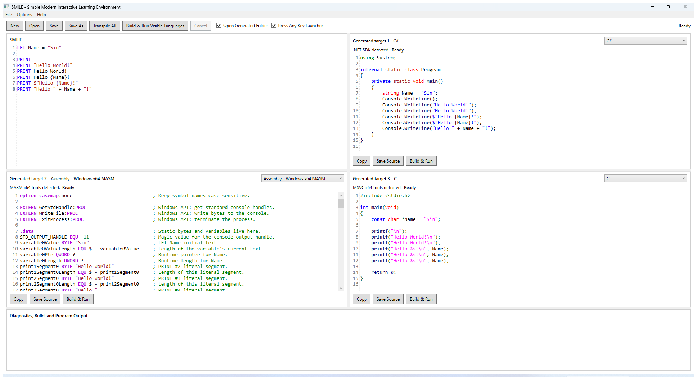

# SMILE

SMILE stands for Simple Modern Interactive Learning Environment. It is a modern programming language inspired by BASIC, designed to help newcomers learn both how to write code and how programming languages work by transpiling and compiling the same logic across multiple target languages.

Write a simple SMILE program once, then compare beginner-readable output across ten active targets: C#, C, Windows x64 MASM Assembly, JavaScript, Java, COBOL, Objective-C, Swift, Python, and C++.

## Mission

SMILE is a modern programming language inspired by BASIC, designed to help newcomers learn not only how to write code, but also how programming languages work at a fundamental level. Building on BASIC’s simplicity and accessibility, SMILE allows students to transpile their code into multiple programming languages and compile the resulting programs. This enables learners to see how the same logic and concepts are expressed using different languages and syntaxes. Through this comparative approach, students can recognize an essential principle: despite their surface-level differences, all programming languages share the same core fundamentals. The primary goal is therefore not to memorize the syntax of a particular language, but to develop logical thinking, problem-solving skills, and a strong understanding of programming concepts. By combining simplicity, experimentation, and cross-language learning, SMILE provides a fun and educational environment that teaches students how to think like programmers.

## Video Introduction

[](https://www.youtube.com/watch?v=fgyIMCdHcug)

[Watch the SMILE introduction on YouTube](https://www.youtube.com/watch?v=fgyIMCdHcug).

## Strategic Reset

The current language baseline is SMILE v0.8.0 — WHILE Loops + LET/SET Block Strings. SMILE is now in a Strategic Reset that recenters the project on its educational purpose: a tiny SMILE program should produce tiny, normal-looking destination code that teaches a learner how that destination language is ordinarily written.

Permanent direction:

- generated source is educational output;
- native, idiomatic target constructs come before custom runtime machinery;
- readability is part of correctness;
- curly braces identify interpolation holes, not general variable references;
- old complexity and old tests are not requirements by themselves;
- KISS and KISS v2, “The Sin Way,” continue to govern the project.

Current development policy:

- all ten implemented targets are active;
- normal work uses focused validation under Velocity Mode;
- the `SMILE CI` workflow is manually dispatchable and is not triggered by every push.

Authority and history are documented in:

- [SMILE Core Principles](docs/SMILE%20Core%20Principles.md)
- [Architecture](docs/Architecture.md)
- [Roadmap](docs/Roadmap.md)
- [Toolchains](docs/Toolchains.md)
- [SMILE Target Code Generation Standard v1.0](docs/SMILE%20Target%20Code%20Generation%20Standard%20v1.0.md)
- [Historical Requirements Index](docs/Historical%20Requirements%20Index.md)

When a dated requirement conflicts with this reset, follow the authority order in `AGENTS.md` and the Core Principles. Do not preserve obsolete behavior merely because an old test expects it.

## Simple SMILE Program

```basic
LET Name = ""
LET Counter = 0

PRINT Enter your name:
INPUT Name

PRINT Hello {Name}.
PRINT Counter={Counter}

SET Counter = Counter + 1

IF Counter = 1 THEN
    PRINT Counter after SET={Counter}
ELSE
    PRINT Counter was not updated.
END IF

WHILE Counter < 3
    SET Counter = Counter + 1
    PRINT Counter in WHILE={Counter}
END WHILE
```

Input:

```text
Sin
```

Output:

```text
Enter your name:
Hello Sin.
Counter=0
Counter after SET=1
Counter in WHILE=2
Counter in WHILE=3
```

`PRINT` currently appends a newline. A prompt followed by `INPUT` therefore appears on the preceding line. SMILE has no hidden prompt suppression; a future no-newline feature would require its own language specification.

## Current Language

SMILE currently includes:

- `LET` declarations for `String`, signed 64-bit `Integer`, and `Boolean` values;
- `SET` mutation of an existing variable from a typed expression;
- `INPUT` mutation of one existing variable from one runtime input line;
- raw, quoted, interpolated, and expression-oriented `PRINT` forms;
- block `IF / ELSE IF / ELSE / END IF` control flow;
- pre-test `WHILE / END WHILE` loops;
- full-line `REM`, `//`, `#`, and `--` comments;
- preserved source-authored blank lines;
- ordinary String literals and LET/SET Block String Literals;
- arithmetic, comparison, Boolean logic, parentheses, and left-to-right short-circuit evaluation.

The cumulative language reference is [examples/language.smile](examples/language.smile). It grows as syntax is added instead of replacing earlier valid examples.

### LET, SET, And INPUT

```basic
LET Name = ""
LET Age = 0
LET Continue = TRUE

INPUT Name
INPUT Age
INPUT Continue

SET Age = Age + 1
```

`LET` declares a variable and fixes its type. `SET` changes the current value from a SMILE expression. `INPUT` reads one normal line, converts it according to the existing variable’s type, and changes that same current storage. Neither `SET` nor `INPUT` declares a variable or changes its type.

For ordinary input:

- String reads the line text without interpreting SMILE source escapes;
- Integer uses ordinary signed decimal conversion;
- Boolean accepts `TRUE` or `FALSE` case-insensitively;
- later expressions read the newly stored runtime value.

Generated programs use normal target input facilities. SMILE no longer requires every target to share a strict UTF-8 byte reader, a 4096-byte line limit, embedded-NUL console behavior, identical parsing internals, or identical runtime-error text.

Curly braces are not variable delimiters. This is correct:

```basic
INPUT Name
SET Name = "Sin"
```

These forms are invalid:

```basic
INPUT {Name}
SET {Name} = "Sin"
```

### PRINT And Interpolation

```basic
PRINT Hello World!
PRINT "Hello World!"
PRINT Hello {Name}!
PRINT $"Age next year: {Age + 1}"
PRINT {Name}
```

Bare `PRINT` text is literal template text. Therefore `PRINT Name` prints the word `Name`, while `PRINT {Name}` interpolates the variable. Ordinary quoted strings do not interpolate; raw templates and `$"..."` strings do.

Curly braces identify interpolation only in text-oriented syntax. Normal expression and identifier positions use normal SMILE syntax without braces.

### IF And WHILE

```basic
IF Age >= 18 THEN
    PRINT Adult
ELSE IF Age >= 13 THEN
    PRINT Teen
ELSE
    PRINT Child
END IF

WHILE Age < 21
    SET Age = Age + 1
END WHILE
```

Conditions are call-free, explicitly compared Boolean expressions. `IF` and `WHILE` retain genuine target control flow. The compiler does not delete unselected branches or unroll loops merely because current values are known.

### Block Strings

```basic
LET Message = "
    First line
    Second line
"
```

A Block String Literal is valid only as the complete value of `LET` or `SET`. The front end owns delimiter scanning, indentation-margin removal, and newline normalization. Target generators receive the resulting ordinary String value rather than reparsing block syntax.

### Official Specifications

- [001 — SET Statement](docs/SMILE%20Language%20Specification/001%20-%20SMILE%20-%20SET%20Statement%20Official%20Specification%20v1.0.md)
- [002 — PRINT Statement](docs/SMILE%20Language%20Specification/002%20-%20SMILE%20-%20PRINT%20Statement%20Official%20Specification%20v1.0.md)
- [003 — String Literals](docs/SMILE%20Language%20Specification/003%20-%20SMILE%20-%20String%20Literals%20Official%20Specification%20v1.0.md)
- [004 — Core Types and Expressions](docs/SMILE%20Language%20Specification/004%20-%20SMILE%20-%20Core%20Types%20and%20Expressions%20Official%20Specification%20v1.0.md)
- [005 — LET Statement](docs/SMILE%20Language%20Specification/005%20-%20SMILE%20-%20LET%20Statement%20Official%20Specification%20v1.0.md)
- [006 — IF Statement](docs/SMILE%20Language%20Specification/006%20-%20SMILE%20-%20IF%20Statement%20Official%20Specification%20v1.0.md)
- [007 — Full-Line Comments and Source Layout](docs/SMILE%20Language%20Specification/007%20-%20SMILE%20-%20Full-Line%20Comments%20and%20Source%20Layout%20Preservation%20Official%20Specification%20v1.0.md)
- [008 — INPUT Statement](docs/SMILE%20Language%20Specification/008%20-%20SMILE%20-%20INPUT%20Statement%20Official%20Specification%20v1.0.md)
- [009 — WHILE Statement](docs/SMILE%20Language%20Specification/009%20-%20SMILE%20-%20WHILE%20Statement%20Official%20Specification%20v1.0.md)

## Active Targets

| Stable ID | Display name | Generated files | Build & Run toolchain |
|---|---|---|---|
| `csharp` | C# | `Program.cs`, `GeneratedProgram.csproj` | .NET SDK 10 or newer |
| `c` | C | `Program.c` | Visual Studio C++ x64 tools |
| `masm-x64` | Assembly — Windows x64 MASM | `Program.asm` | Visual Studio C++ x64 tools with `ml64` and `link.exe` |
| `javascript` | JavaScript | `Program.js` | Node.js |
| `java` | Java | `Program.java` | JDK |
| `cobol` | COBOL | `Program.cob`, optional support `.c` | MSYS2 GnuCOBOL |
| `objective-c` | Objective-C | `Program.m` | MSYS2 MinGW64 Clang |
| `swift` | Swift | `Program.swift` | Swift.Toolchain for Windows plus Visual Studio linker tools |
| `python` | Python | `Program.py` | Python 3.10 or newer |
| `cpp` | C++ | `Program.cpp` | Visual Studio x64 C++ tools |

One central `ActiveTargetLanguages` policy governs product exposure, default toolchain detection, `--target all`, Transpile All, and routine test enumeration. `all` means all ten implemented targets. Build & Run requires the matching local toolchain; transpilation itself does not.

No eleventh destination language may be added or recommended unless Sin explicitly reopens target expansion.

## Generated Output Direction

Generated source is a primary teaching artifact. It must be minimal, proportional to the SMILE program, recognizable to a beginner, deterministic, and dependency-light.

Python is intentionally generated as a direct executable script so the teaching correspondence stays visible. A one-statement SMILE program:

```basic
PRINT "Hello World"
```

becomes the ordinary top-level Python statement:

```python
print("Hello World")
```

SMILE adds Python imports and helper functions before learner statements only when the bound program requires them. It does not add a boilerplate function or module-entry guard merely to make a runnable script.

The reset-reference targets illustrate the normal direction:

| SMILE concept | C# | C | Windows x64 MASM |
|---|---|---|---|
| `PRINT` | `Console.WriteLine` | `printf` | clear CRT/Win64 output calls |
| String `INPUT` | `Console.ReadLine` | `fgets` when line input is needed | a straightforward CRT/Win64 read path |
| Integer `INPUT` | conventional parse/conversion | `scanf` or another clear native conversion | recognizable `scanf`-style conversion and storage |
| `IF` | native `if` | native `if` | readable compare-and-branch labels |
| `WHILE` | native `while` | native `while` | readable condition/body/back-edge/exit labels |
| interpolation | native interpolation | clear `printf` formatting | direct format arguments or equally clear lowering |

Do not generate a byte reader, UTF-8 state machine, common byte-limit subsystem, target-neutral runtime library, or generic error dispatcher for a simple beginner program merely to erase obscure differences among runtimes.

Custom helpers are allowed only when an approved current semantic rule genuinely needs one and the helper is the smallest clearer solution. See the [target generation standard](docs/SMILE%20Target%20Code%20Generation%20Standard%20v1.0.md) for the complete checklist.

## Requirements

Normal current development requires:

- Windows;
- .NET SDK 10 or newer;
- the matching local toolchain for each target you want to Build & Run.

SMILE discovers Visual Studio with `vswhere.exe`; it does not hard-code a year, edition, or install directory. See [Toolchains](docs/Toolchains.md) for the ten active toolchains, stdin modes, temporary workspaces, and troubleshooting.

## Build, Test, And Run

Run commands from the repository root.

### Velocity Tier 1 — Tiny Or Local Change

Documentation-only changes use focused static checks. Small code changes run the narrowest relevant test and the smallest Debug build that proves compilation.

```powershell
dotnet test tests/SMILE.Tests/SMILE.Tests.csproj -c Debug --filter "FullyQualifiedName~InputStatementConformanceTests" -nologo
```

### Velocity Tier 2 — Normal Feature Or Fix

Run focused subsystem tests, active-target generation coverage, the `MissionGuardrail` category, and one affected Debug build or smoke test.

```powershell
dotnet test tests/SMILE.Tests/SMILE.Tests.csproj -c Debug --filter "FullyQualifiedName~InputStatementConformanceTests|FullyQualifiedName~InputEvaluatorTests|FullyQualifiedName~ActiveTargetLanguageTests" -nologo
dotnet test tests/SMILE.Tests/SMILE.Tests.csproj -c Debug --filter TestCategory=MissionGuardrail -nologo
dotnet test tests/SMILE.Tests/SMILE.Tests.csproj -c Debug --filter "FullyQualifiedName~ActiveTargetLanguageTests" -nologo
```

### Velocity Tier 3 — Major Milestone

Restore and build the affected solution, then run the comprehensive suite appropriate to the milestone:

```powershell
dotnet restore SMILE.sln
dotnet build SMILE.sln -c Debug --no-restore -nologo
dotnet test tests/SMILE.Tests/SMILE.Tests.csproj -c Debug --no-build --no-restore --filter "TestCategory!=HistoricalExactInput" -nologo
```

`HistoricalExactInput` preserves the superseded strict 4096-byte INPUT suite for explicit historical checks. It is intentionally outside current milestone and manual-CI gates because target-native INPUT edge behavior is now allowed.

Add Release validation when release risk justifies it. Legacy gates such as `SMILE_REQUIRE_JAVA`, `SMILE_REQUIRE_ALL_TARGETS`, and cross-target `SMILE_REQUIRE_ZERO_TARGET_WARNINGS` are not routine reset requirements.

### Manual SMILE CI

`.github/workflows/smile-ci.yml` retains the hosted Windows Debug/Release job but currently exposes only `workflow_dispatch`.

```powershell
gh workflow run "SMILE CI" --ref main
gh run list --workflow "SMILE CI" --branch main --limit 10
```

Normal pushes do not require a workflow run during Velocity Mode, and the old exact-SHA post-push completion gate is suspended. When Velocity Mode ends, restore the `push` and `pull_request` triggers and update `AGENTS.md` plus current documentation in the same small change.

### Run The Apps

```powershell
dotnet run --project src/SMILE.Desktop
dotnet run --project src/SMILE.Cli -- examples/language.smile --target all
dotnet run --project src/SMILE.Cli -- examples/input.smile --target csharp --run
```

Current target IDs are `csharp`, `c`, `masm-x64`, `javascript`, `java`, `cobol`, `objective-c`, `swift`, `python`, `cpp`, and `all`. CLI execution containing `INPUT` inherits the invoking terminal and streams output normally. Compiler and linker processes receive closed stdin; only the generated program receives interactive or scripted input.

## Desktop Application

The Desktop title is `SMILE - Simple Modern Interactive Learning Environment`. It opens maximized, finishes its first paint, then asynchronously loads the packaged cumulative [language reference](examples/language.smile) and transpiles only the visible active targets. Toolchain detection, transpilation, build/run work, process output, and file operations stay off the WPF UI thread.

The top-left pane edits SMILE. The three target panes default to C#, Assembly — Windows x64 MASM, and C, and their selectors expose the active target set. Each target pane remains an independent editable build unit with Copy, Save Source, Open Generated Folder, Build & Run, Maximize/Restore, and optional Press Any Key launcher behavior. `Transpile All` means all active targets.

A completed background generation result may update a pane only if its captured source, selected language, and learner-edit revision are still current. Later source edits, target edits, language changes, New, and explicit transpilation retain their established authority ordering so stale work never overwrites a newer learner action.

For INPUT programs, Desktop Build & Run opens one visible interactive console. The learner sees PRINT output, enters input, and observes completion while the IDE remains responsive. Cancel terminates the child process tree without adding a hidden SMILE loop limit.

Recoverable toolchain detection, build/run, process, folder-opening, command refresh, and logging failures appear as concise messages without closing the IDE. Detailed logs are written to `%LOCALAPPDATA%\SMILE\Logs`, with `%TEMP%\SMILE\Logs` as fallback.



Current Desktop build version: `0.8.0 WHILE Loops + LET/SET Block Strings`.

## Diagnostics And Runtime Failures

SMILE reports source syntax, binding, and compile-time semantic failures as diagnostics instead of ordinary crashes. Stable diagnostic families include:

- `SMILE10xx` for source/token failures;
- `SMILE11xx` for PRINT, LET, interpolation, and source-layout failures;
- `SMILE12xx` for expression and source-known arithmetic failures;
- `SMILE13xx` for SET and Block String failures;
- `SMILE14xx` for IF failures;
- `SMILE15xx` for INPUT syntax and binding failures;
- `SMILE16xx` for WHILE failures.

The official specifications define the current source rules and diagnostic details.

Runtime input failure is not a compile diagnostic. The reference evaluator contains it, preserves prior output where practical, stops later statements, and reports a concise unsuccessful result. Generated targets may use normal target-language failure handling; they are not required to reproduce the evaluator’s exact code, wording, parser internals, byte boundary, or exit status for obscure invalid-input cases.

`SMILER1502`, the old universal 4096-byte input-limit failure, is retired from the current INPUT contract. Other evaluator runtime identities may remain useful internally without requiring a generated cross-target error dispatcher.

## Architecture

```text
Source
  -> Lexer and source-layout classification
  -> Parser and syntax tree
  -> Binder and typed bound tree
  -> Branch/loop-aware analysis and safe simplification
  -> Active-target generator
  -> Learner-facing generated files
  -> Optional local toolchain build and run
```

`SMILE.Engine` owns the shared language front end, bound representation, evaluator, analysis, target identifier mapping, and generators. Target generators consume the shared bound tree and do not reparse SMILE source. `SMILE.Toolchains` owns detection, temporary workspaces, process input modes, async execution, cancellation, timeout, and build/run. `SMILE.Cli` provides the developer harness, while `SMILE.Desktop` provides the responsive learning environment.

See [Architecture](docs/Architecture.md) for subsystem boundaries, active-target policy consumers, input behavior, and historical architecture notes.

## Repository Structure

```text
SMILE.sln
AGENTS.md
README.md
.github/workflows/smile-ci.yml
examples/
Requirements/
  2026-08-08 - Re-strategize SMILE/
  SMILE Coding Standards/
  Archive/Pre-Strategic-Reset/
docs/
  SMILE Core Principles.md
  SMILE Language Specification/
src/
  SMILE.Engine/
  SMILE.Toolchains/
  SMILE.Cli/
  SMILE.Desktop/
tests/SMILE.Tests/
```

Current strategy and standards live at the active paths shown above. Completed pre-reset briefs and progress artifacts live under `Requirements/Archive/Pre-Strategic-Reset/`; consult the [Historical Requirements Index](docs/Historical%20Requirements%20Index.md) before treating a dated brief as current authority.

Generated build/run workspaces are created under `%TEMP%\SMILE\Runs`, never inside the repository. SMILE-owned generated artifacts older than one day may be cleaned from known `bin`, `obj`, `out`, and temporary run locations.

## Current Limitations

- Core types are limited to `String`, signed 64-bit `Integer`, and `Boolean`.
- `INPUT` has one existing-variable form, no built-in prompt, no automatic retry, and no multiple-target or declaration syntax.
- INPUT edge behavior follows normal target facilities; malformed bytes, locale details, line-size limits, embedded NUL, exact error text, and unusual EOF/line-ending behavior are not universally identical.
- C String INPUT currently uses a target-local 256-byte `fgets` buffer, while MASM uses a 255-character `scanf` scanset; their native truncation, whitespace, empty-line, and mixed-input stream behavior is not a universal SMILE contract.
- IF is block-only and has no branch-local LET or scope. Every atomic condition requires an explicit comparison.
- WHILE is pre-test and block-only. There is no `WEND`, `BREAK`, `CONTINUE`, post-test loop, or loop-local LET.
- Block Strings are complete LET/SET values, not general multiline expressions.
- Comments are full-line only. Inline, trailing, block, and documentation-comment semantics are not implemented.
- Syntax highlighting is lexical; semantic highlighting, autocomplete, and diagnostic squiggles are future work.
- C and MASM Build & Run currently focus on Windows local toolchains.
- Ordinary MASM programs use the concise CRT path, including direct checked Integer instructions. Exact source-authored embedded-NUL Strings may still select the older compatibility lowering because those values cannot be represented by plain C-string calls alone.
- Full Desktop UI automation is not included; release-level work still requires appropriate manual WPF smoke testing.
- Target-native INPUT and unusual host edge behavior can differ across the ten runtimes; ordinary valid programs remain the shared conformance focus.

## Roadmap

The 2026-08-08 Strategic Reset was implemented in this dependency order:

1. establish governance, authority, and historical classification;
2. centralize the active-target policy;
3. simplify INPUT around current native semantics;
4. rewrite C#, C, and MASM output for beginner readability;
5. add `MissionGuardrail` readability tests and focused active-target conformance;
6. align Desktop, CLI, toolchains, examples, and current documentation;
7. complete focused source guardrails plus native build/run validation for the three reset-reference targets.

On 2026-08-10 all seven retained targets were reactivated through the central policy, restoring ten-target Desktop/CLI exposure, detection, transpilation, and Build & Run. Velocity Mode remains focused: ordinary changes validate the affected targets rather than repeating a strict ten-toolchain matrix.

Future language ideas remain functions and scopes, additional numeric types, structured loop control, debugging/source mapping, richer editor assistance, and a reusable web interface. These are roadmap items, not implemented features.

See [Roadmap](docs/Roadmap.md) for the implemented reset sequence, all-target reactivation, and clearly labeled historical milestones.

## License

SMILE is licensed under GNU Affero General Public License v3.0 only (`AGPL-3.0-only`). See [LICENSE](LICENSE).

SMILE.Desktop uses AvalonEdit 6.3.1.120 for WPF editor panes. AvalonEdit is licensed under MIT; its notice is recorded in [THIRD-PARTY-NOTICES.md](THIRD-PARTY-NOTICES.md).
